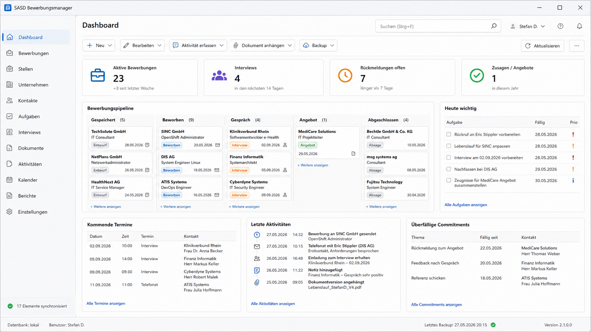

# UI-/UX-Konzept – Windows Forms

> **Status:** Designbaseline, kein Pixelvertrag  
> **Dokumentversion:** 1.0  
> **Stand:** 2026-08-24  
> **Geltungsbereich:** Produktversion 1.0  
> **Projekt:** SASD Bewerbungsmanager

## 1. Ziel

Die Anwendung soll wie ein **professionelles Windows-Arbeitswerkzeug** wirken: informationsreich, schnell, tastaturbedienbar und langfristig wartbar. Sie ist kein Web-Dashboard im Desktopfenster und kein Designexperiment.

Das Konzeptbild liegt unter [../images/dashboard-concept.png](../images/dashboard-concept.png). Es zeigt die gewünschte Informationsarchitektur, ist aber **nicht pixelgenau verbindlich**.

## 2. MainForm als Shell

Die MainForm besitzt dauerhaft:

- linke Hauptnavigation;
- Kopfbereich mit Seitentitel und globaler Suche;
- kontextbezogene Toolbar;
- zentralen Content-Bereich;
- Statusleiste für Datenbank/Backup/Version/Operationen.

Die MainForm enthält keine Fachlogik. Jede größere Ansicht besitzt einen Presenter und einen expliziten View-Vertrag.

## 3. Hauptnavigation

Empfohlene Reihenfolge:

1. Dashboard
2. Bewerbungen
3. Stellen
4. Unternehmen
5. Kontakte
6. Aufgaben
7. Interviews
8. Dokumente
9. Aktivitäten
10. Kalender
11. Berichte
12. Einstellungen

Navigation soll den Kontext erhalten, soweit sinnvoll. Ein Doppelklick auf Suchergebnis, Boardkarte oder Aktivität öffnet dieselbe Bewerbungsdetailansicht statt neue Spezialfenster einzuführen.

## 4. Dashboard „Heute“

Das Dashboard beantwortet innerhalb weniger Sekunden:

- Was ist heute fällig?
- Wo fehlt eine Next Action?
- Welche Zusage ist überfällig?
- Welche Gespräche stehen bevor?
- Welche Bewerbungen befinden sich in welcher Phase?

### Bereiche

- KPI-Karten nur für wenige handlungsrelevante Kennzahlen;
- Pipeline-Kompaktansicht;
- „Heute wichtig“ mit Tasks/Next Actions;
- kommende Termine;
- letzte Aktivitäten;
- überfällige Commitments;
- Backupstatus als ruhiger Betriebsindikator.

Keine dekorativen Diagramme ohne Entscheidungshilfe.

## 5. Bewerbungsdetailansicht

Die zentrale Detailansicht sollte nicht alles gleichzeitig zeigen. Vorgeschlagene Tabs/Abschnitte:

- **Übersicht:** Rolle, Unternehmen, Status, Priorität, Next Action, Quelle, Ergebnis;
- **Timeline:** chronologische Aktivitäten und Statuswechsel;
- **Kontakte:** beteiligte Personen und Rollen;
- **Interviews:** Runden, Teilnehmer, Fragen, Notizen;
- **Dokumente:** verwendete Dokumentversionen und Stellenanzeigen-Snapshots;
- **Aussagen:** quellenbezogene Informationen;
- **Aufgaben/Zusagen:** offene und historische Punkte.

## 6. Listenansichten

DataGridView-orientierte Listen sollen produktiv filtern/sortieren können. Regeln:

- Spaltenbreiten sinnvoll vorbelegen;
- wichtige Spalten links;
- kein horizontaler Scrollzwang für Kerninformationen bei 1440px Breite;
- Details nicht in 20 Spalten pressen;
- virtuelle/paginierte Darstellung bei großen Mengen, wo nötig;
- Mehrfachauswahl nur für fachlich sichere Bulk-Aktionen.

## 7. Pipeline-/Boardansicht

Das Board dient der visuellen Übersicht, nicht als alleinige Datenpflegeoberfläche.

- Karten zeigen Unternehmen, Rolle, Datum und wenige Statusindikatoren;
- Drag & Drop darf Statuswechsel nur auslösen, wenn fachlich zulässig;
- ein Statuswechsel erzeugt History;
- bei riskanten/mehrdeutigen Übergängen erscheint ein Dialog;
- Tastaturalternative zu Drag & Drop ist vorhanden.

## 8. Formulare und Editieren

- Label oberhalb oder links eines Felds, konsistent je Formular;
- erforderliche Felder eindeutig markieren;
- Validierung nahe am Feld, keine reine MessageBox-Kaskade;
- `Speichern`, `Abbrechen` und destruktive Aktionen klar getrennt;
- Dirty State beim Navigieren/Schließen behandeln;
- Datum/Zeit mit Windows-typischen Controls und sinnvoller Tastaturführung.

## 9. Dialogregeln

Dialoge nur für:

- kurze modale Entscheidungen;
- Bestätigungen mit realer Konsequenz;
- Datei-/Import-/Restore-Workflows;
- Statuswechsel mit Zusatzinformation.

Komplexe fachliche Bearbeitung gehört in eigenständige Content-Views, nicht in verschachtelte Modal-Dialoge.

## 10. Farben und Status

Farbe unterstützt Bedeutung, darf sie aber nicht allein tragen.

- Blau: aktive/gewöhnliche Aktion;
- Grün: Erfolg/Angebot/erledigt;
- Orange: anstehend/Interview/Warnung;
- Rot: überfällig/Fehler/destruktiv;
- Grau: archiviert/abgeschlossen/inaktiv.

Immer zusätzlich Text/Icon/Statusbezeichnung.

## 11. Tastatur und Accessibility

- logische Tabreihenfolge;
- `Ctrl+F` globale Suche;
- `Ctrl+N` kontextabhängig „Neu“;
- `Ctrl+S` in Editierkontext;
- `Esc` schließt ungefährliche Dialoge/Abbruch;
- Menüs und Kernaktionen ohne Maus erreichbar;
- AccessKeys, AccessibleName/Description für wichtige Controls;
- Fokus sichtbar;
- keine Information nur per Tooltip.

## 12. DPI und Bildschirmgrößen

Releaseprüfungen mindestens 100, 125, 150 und 200 %. Keine absoluten Pixelannahmen, die Texte abschneiden. Die Anwendung bleibt ab typischer 1366×768-Arbeitsfläche grundsätzlich bedienbar; optimiert wird für 1920×1080 und höher.

## 13. Fehlermeldungen

Eine gute Meldung beantwortet:

1. Was ist fehlgeschlagen?
2. Was wurde **nicht** verändert?
3. Was kann der Benutzer jetzt tun?
4. Welche Fehlerreferenz hilft bei Diagnose?

Stacktraces und technische Details gehören nicht in die normale Benutzeroberfläche.

## 14. Empty/Loading/Error States

Jede zentrale View besitzt explizit:

- Loading State;
- Empty State mit nächster sinnvoller Aktion;
- Error State mit Retry/Diagnose;
- normalen Datenzustand;
- ggf. Disabled/Maintenance State.

## 15. UX-Abnahme vor 1.0

- fünf zentrale Workflows ausschließlich mit Tastatur durchlaufen;
- DPI-Matrix sichten;
- synthetischen Datenbestand mit mehreren hundert sichtbaren Objekten testen;
- Restore-/Importdialoge besonders auf Fehlbedienung prüfen;
- destruktive Aktionen auf Eindeutigkeit prüfen;
- Dashboard darf nicht mehr Warnungen erzeugen als handlungsrelevante Informationen.
