# Architekturdokument – SASD Bewerbungsmanager Version 1.0 (Windows Forms)

**Dokumenttyp:** Software Architecture Document (SAD) / technische Zielarchitektur  
**Projekt:** SASD Bewerbungsmanager  
**Zielversion:** 1.0  
**Zielplattform:** Windows Desktop  
**UI-Technologie:** Windows Forms (WinForms)  
**Programmiersprache:** C#  
**Target Framework:** .NET 10 LTS, `net10.0-windows`  
**Architekturstil:** modularer Monolith, geschichtete Architektur, feature-orientierte Module, MVP/Presenter, leichtgewichtiges CQRS an der Application-Grenze  
**Persistenz:** SQLite mit Entity Framework Core 10  
**Betriebsmodell:** local-first, Einzelbenutzer, offline-fähig  
**Primäre Zielplattform:** Windows 11 x64  
**Dokumentstatus:** Draft / Architektur-Freigabebasis  
**Stand:** 24. August 2026  
**Primäres Eingangsartefakt:** `SASD-Bewerbungsmanager-Pflichtenheft-v1.0-WinForms.md`  
**Übergeordnetes fachliches Artefakt:** `SASD-Bewerbungsmanager-Lastenheft-v1.0.md`  
**Normativer Bezug:** SASD Development Standard – Approved Baseline 0.9.0 / Version-1.0-Specification-Candidate; Profile Core + C#/.NET + Desktop

---

# 1. Zweck und Rolle des Architekturdokuments

Dieses Dokument beschreibt die **verbindliche technische Architektur** des SASD Bewerbungsmanagers Version 1.0. Es konkretisiert die im Pflichtenheft festgelegten technischen Anforderungen zu einem konsistenten Systementwurf und beantwortet insbesondere folgende Fragen:

- Wie ist die Anwendung in Schichten, Module und Komponenten zerlegt?
- Welche Verantwortlichkeiten liegen in WinForms, Application, Domain und Infrastructure?
- Welche Abhängigkeiten sind zulässig und welche ausdrücklich verboten?
- Wie werden fachliche Vorgänge, Abfragen, Transaktionen und Fehler technisch abgewickelt?
- Wie werden Daten, historische Informationen und Dokumentdateien konsistent gespeichert?
- Wie werden UI-Lebenszyklus, Threading und Hintergrundoperationen beherrscht?
- Wie werden Backup, Restore, Migration und Wiederanlauf fehlertolerant umgesetzt?
- Welche Sicherheits- und Datenschutzgrenzen gelten?
- Wie bleibt die Architektur testbar, wartbar und für spätere Integrationen erweiterbar?
- Welche Architekturentscheidungen sind bereits getroffen und welche benötigen einen ADR?

Das Dokument ist die technische Referenz für Implementierung, Review, Tests und spätere Architekturänderungen. Es darf nicht als bloße Empfehlung behandelt werden, soweit eine Festlegung mit **MUSS**, **DARF NICHT** oder als „verbindlich“ formuliert ist.

## 1.1 Verhältnis zu Lastenheft und Pflichtenheft

Die Artefakthierarchie lautet:

```text
Lastenheft
  │  Was soll das Produkt fachlich leisten?
  ▼
Pflichtenheft
  │  Wie soll die technische Lösung diese Anforderungen erfüllen?
  ▼
Architekturdokument
  │  Welche Strukturen, Grenzen, Laufzeitmodelle und technischen Regeln
  │  machen diese Umsetzung konsistent und wartbar?
  ▼
ADRs / Implementierungsdesign / Code / Tests
```

Bei Widersprüchen gilt folgende Reihenfolge:

1. freigegebenes Lastenheft;
2. freigegebenes Pflichtenheft;
3. dieses Architekturdokument;
4. ADRs;
5. Implementierungsdetails.

Ein ADR darf eine verbindliche Festlegung dieses Dokuments nur ändern, wenn das Architekturdokument gleichzeitig angepasst oder die Abweichung ausdrücklich als Änderung der Architektur freigegeben wird.

## 1.2 Normative Begriffe

- **MUSS** – für V1.0 verbindlich.
- **SOLL / SOLLTE** – vorgesehene Lösung; Abweichung benötigt nachvollziehbare Begründung.
- **KANN** – zulässige Option oder späterer Erweiterungspunkt.
- **DARF NICHT** – ausgeschlossene Lösung.

## 1.3 Zielgruppe des Dokuments

Das Dokument richtet sich an:

- Softwareentwickler;
- Codex-/KI-Entwicklungsagenten, die im Repository arbeiten;
- Reviewer;
- Testverantwortliche;
- Release-/Build-Verantwortliche;
- spätere Maintainer;
- den Product Owner als technische Referenz.

---

# 2. Architekturtreiber

Die Architektur wird nicht aus abstrakten Mustern abgeleitet, sondern aus den tatsächlichen Produktanforderungen. Für V1.0 sind folgende Treiber entscheidend.

## 2.1 Fachliche Treiber

1. **Vollständige Bewerbungsakte:** Eine Bewerbung muss als zusammenhängender Vorgang mit Stelle, Unternehmen, Kontakten, Timeline, Aufgaben, Next Action, Commitments, Interviews und Dokumentversionen rekonstruierbar sein.
2. **Historische Nachvollziehbarkeit:** Statuswechsel, Aussagen, Stellenanzeigen-Snapshots und versendete Dokumentversionen dürfen durch spätere Änderungen nicht ihre historische Bedeutung verlieren.
3. **Unterschiedliche fachliche Objekte bleiben getrennt:** Opportunity, JobPosting und Application sind nicht dasselbe; Task und Commitment sind nicht dasselbe; Document und DocumentVersion sind nicht dasselbe.
4. **Next Action als Steuerungsprinzip:** Der Anwender muss jederzeit erkennen können, welcher Vorgang Aufmerksamkeit benötigt.
5. **Kontakte als eigenständiges CRM-Element:** Recruiter und Ansprechpartner können mit mehreren Vorgängen verbunden sein.
6. **Quellenbezogene Aussagen:** Widersprüchliche Aussagen dürfen parallel existieren, inklusive Quelle und Zeitpunkt.

## 2.2 Qualitäts- und Betriebs-Treiber

1. **Local first und offline:** Alle Kernfunktionen müssen ohne Internet funktionieren.
2. **Datenhoheit:** Daten und verwaltete Dokumente liegen lokal im Benutzerprofil und können offen exportiert werden.
3. **Wiederherstellbarkeit:** Backup und Restore sind Release-relevante Kernfunktionen.
4. **Robustheit:** Ein Fehler beim Import, Restore oder Dokumentzugriff darf den übrigen Bestand nicht unbrauchbar machen.
5. **Performance:** 10.000 Vorgänge und 50.000 Aktivitäten bilden den Referenzbestand.
6. **Testbarkeit:** Fachlogik darf nicht von WinForms abhängen; kritische Presenter müssen ohne gestartete Desktopanwendung testbar sein.
7. **Designerfähigkeit:** WinForms-Forms und UserControls müssen im Visual-Studio-Designer pflegbar bleiben.
8. **Wartbarkeit:** Technologie- und UI-Details dürfen die Domäne nicht dominieren.
9. **Privacy by Design:** Keine Telemetrie, keine versteckten Netzaufrufe, keine fachlichen Inhalte in Logs.
10. **Upgradefähigkeit:** V1.x-Schemaänderungen müssen reproduzierbar migrierbar und getestet sein.

## 2.3 Architektur-Qualitätsziele in Prioritätsreihenfolge

| Priorität | Qualitätsziel | Architekturfolge |
|---:|---|---|
| 1 | Datenintegrität | explizite Invarianten, DB-Constraints, Transaktionen, versionierte Migrationen |
| 2 | Wiederherstellbarkeit | konsistente Backups, Staging-Restore, Integritätsprüfung |
| 3 | Wartbarkeit | klare Schichten und Feature-Grenzen, geringe Abhängigkeitszahl |
| 4 | Testbarkeit | UI-freie Domain/Application, Presenter-Verträge, echte SQLite-Integrationstests |
| 5 | Benutzerreaktivität | Hintergrundausführung blockierender Operationen, Projektionen, Paging |
| 6 | Datenschutz | lokale Daten, minimale Logs, kein Netzbedarf |
| 7 | Erweiterbarkeit | Ports für E-Mail/Kalender/Jobquellen, aber keine V1-Pluginplattform |
| 8 | Einfachheit | modularer Monolith statt Services/Event-Bus/Distributed Systems |

---

# 3. Technische Randbedingungen und Nicht-Ziele

## 3.1 Verbindliche Randbedingungen

- C# auf .NET 10 LTS;
- `net10.0-windows`;
- Windows Forms;
- Windows 11 x64;
- SQLite;
- Entity Framework Core 10 mit Microsoft SQLite Provider;
- Single-User-/Single-Profile-Modell;
- self-contained `win-x64` Deployment;
- lokale Datenablage unter `%LOCALAPPDATA%`;
- Generic Host für DI, Logging, Konfiguration und Lifetime;
- keine produktiven Preview-Pakete.

.NET 10 ist zum Dokumentstand eine aktive LTS-Version. Die Architektur setzt voraus, dass das Produkt während seines Lebenszyklus auf unterstützten .NET-10-Patches gehalten wird.

## 3.2 Bewusste Nicht-Ziele für V1.0

Die Architektur soll folgende Themen **nicht** vorsorglich „auf Enterprise aufblasen“:

- keine Microservices;
- kein lokaler HTTP-Server;
- keine verteilte Datenbank;
- keine Mehrbenutzer-Synchronisation;
- kein Event Sourcing;
- kein CQRS mit getrennten Read-/Write-Datenbanken;
- kein Message Broker;
- kein allgemeiner In-Process-Event-Bus;
- kein Plugin-Marktplatz;
- kein Domain-Repository für jede Tabelle nur aus Mustergründen;
- keine Auto-Apply- oder Jobportal-Automatisierung;
- keine IMAP-/OAuth-/Cloudintegration im V1-Kern;
- keine generative KI als Kernabhängigkeit.

Diese Nicht-Ziele sind wichtig: Erweiterbarkeit soll über **klare Ports und stabile Fachmodelle**, nicht über vorzeitig eingeführte Infrastruktur erreicht werden.

---

# 4. Architekturprinzipien

## 4.1 Fachlogik gehört nicht in Forms

WinForms verarbeitet Darstellung, Eingabe, Fokus, Tastatur, Navigation und UI-Zustände. Fachliche Regeln, Datenzugriffe, Merge-Logik, Statusübergänge oder Backup-Operationen dürfen nicht in Click-Handlern implementiert werden.

## 4.2 Abhängigkeiten zeigen nach innen

Die äußeren technischen Schichten dürfen die inneren fachlichen Schichten kennen; umgekehrt nicht.

```text
WinForms ───────────────► Application ───────────────► Domain
                               ▲                         ▲
                               │                         │
Infrastructure ────────────────┴─────────────────────────┘
```

## 4.3 Features strukturieren Code, Schichten strukturieren Abhängigkeiten

Die Solution wird in vier technische Projekte geteilt. Innerhalb dieser Projekte erfolgt die Ordnung **feature-orientiert** (`Applications`, `Companies`, `Contacts`, `Documents`, …), nicht nach generischen Ordnern wie `Managers`, `Helpers` oder `Utils`.

## 4.4 Keine abstrakte Schicht ohne konkreten Nutzen

Abstraktionen werden an stabilen Grenzen eingesetzt:

- Application ↔ Infrastructure;
- Presenter ↔ View;
- Application ↔ UI-Services;
- Dateisystem/Backup/Search als technische Ports.

Es wird **kein Generic Repository** wie `IRepository<TEntity>` als universelle Datenzugriffsfassade eingeführt. Fachlich unterschiedliche Abfragen und Schreibvorgänge benötigen unterschiedliche Verträge.

## 4.5 Historie ist explizite Fachinformation, kein Event-Sourcing

Timeline, StatusHistory und CommitmentHistory werden persistent gespeichert. Das System rekonstruiert seinen aktuellen Zustand jedoch **nicht** durch Replay aller Ereignisse. Aktueller Zustand und Historie werden bei relevanten Schreibvorgängen gemeinsam konsistent aktualisiert.

## 4.6 Datenbank ist Quelle fachlicher Wahrheit; Suchindex und Cache sind abgeleitet

SQLite plus verwalteter Dokumentstore bilden den Primärbestand. Volltextindizes, Dashboardprojektionen und Caches müssen aus Primärdaten wiederherstellbar sein.

## 4.7 Explizite Transaktionen statt versteckter Seiteneffekte

Jeder mehrschrittige Schreib-Use-Case definiert seine atomare Grenze. Ein Statuswechsel, Merge oder Next-Action-Wechsel darf nicht aus unabhängigen, unkoordinierten Speichervorgängen bestehen.

## 4.8 Local-first bedeutet auch transparente Netzgrenzen

Im V1-Kern existiert kein Hintergrundnetzverkehr. Externe URLs werden nur durch explizite Benutzeraktion geöffnet. Spätere Integrationen müssen als klar erkennbare Adapter hinzukommen.

## 4.9 Reversibilität vor Destruktion

Archivierung wird gegenüber Löschen bevorzugt. Migration, Restore, Merge und Import erhalten Vorschau, Backup oder Recovery-Weg, wenn ein Fehler zu dauerhaftem Datenverlust führen könnte.

---

# 5. Systemkontext

## 5.1 Systemgrenze

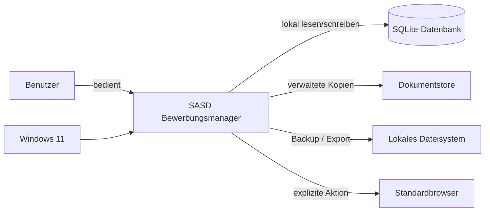

Der Bewerbungsmanager ist ein **lokales Desktopprodukt**. SQLite und Dokumentstore sind keine externen Systeme im betrieblichen Sinn, werden architektonisch aber als getrennte Persistenzressourcen behandelt, weil Datenbanktransaktionen und Dateisystemoperationen nicht gemeinsam atomar sind.

## 5.2 Externe Akteure und Systeme in V1

| Akteur/System | Beziehung | Vertrauensniveau |
|---|---|---|
| Benutzer | vollständige Bedienung und Datenhoheit | vertrauenswürdig, Eingabefehler möglich |
| Windows-Dateisystem | Persistenz, Import, Export, Backup | technisch vertrauenswürdig, Inhalt nicht automatisch vertrauenswürdig |
| importierte CSV-Datei | Eingangsdaten | untrusted input |
| importierte Dokumentdatei | verwaltetes Dokument | untrusted content |
| Backupcontainer | Restorequelle | untrusted bis vollständig validiert |
| Stellenanzeigen-HTML/Text | Snapshot | untrusted content |
| externe URL | Navigation in Browser | untrusted target |
| Standardbrowser | wird nur explizit gestartet | externe Prozessgrenze |

## 5.3 Spätere, aber nicht implementierte Integrationsgrenzen

Architektonisch reservierte Ports können später ergänzt werden für:

- E-Mail-Import;
- Kalenderintegration;
- Jobportal-/Provider-Import;
- Browser-Capture;
- optionale KI-Analyse;
- Cloud-/Gerätesynchronisierung.

Keiner dieser Ports darf V1-Fachobjekte in provider-spezifische Typen verwandeln.

---

# 6. Container- und Komponentenarchitektur

## 6.1 Laufzeitcontainer

Obwohl das Produkt als einzelner Prozess ausgeliefert wird, werden vier logische Container unterschieden:

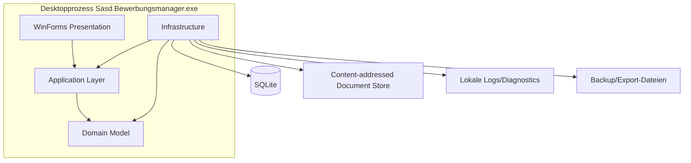

## 6.2 Hauptverantwortlichkeiten

### WinForms

- Main shell und Navigation;
- Forms/UserControls/Dialoge;
- Presenter und UI-spezifische Display Models;
- Tastatur, Fokus, DPI, Theme, Accessibility;
- UI-Dispatcher;
- Dialog-/Clipboard-/Browser-/FilePicker-Services;
- Fortschritt und Cancellation UI;
- keine direkte Persistenz.

### Application

- Use Cases;
- Commands und Queries;
- Validierung auf Use-Case-Ebene;
- Orchestrierung von Domain und Ports;
- Transaktionsanforderungen;
- Read-/Write-Verträge zur Infrastructure;
- DTOs/Read Models;
- Result-/Fehlermodelle;
- keine WinForms-Typen.

### Domain

- Entities und Value Objects;
- fachliche Invarianten;
- Statusregeln;
- Berechnungen ohne technische Seiteneffekte;
- fachliche Enums/Policies;
- keine EF-, Dateisystem-, Logging- oder UI-Abhängigkeit.

### Infrastructure

- EF Core / SQLite;
- Migrationsmanagement;
- Query-Projektionen;
- Document Store;
- Backup/Restore;
- Import/Export;
- Dateisystem;
- Suchindex;
- Logging-Sinks/Diagnose;
- technische Implementierung der Application-Ports.

---

# 7. Solution- und Repository-Architektur

## 7.1 Verbindliche Solution

```text
Sasd.Bewerbungsmanager.sln
│
├── src/
│   ├── Sasd.Bewerbungsmanager.WinForms/
│   ├── Sasd.Bewerbungsmanager.Application/
│   ├── Sasd.Bewerbungsmanager.Domain/
│   └── Sasd.Bewerbungsmanager.Infrastructure/
│
├── tests/
│   ├── Sasd.Bewerbungsmanager.Domain.Tests/
│   ├── Sasd.Bewerbungsmanager.Application.Tests/
│   ├── Sasd.Bewerbungsmanager.Infrastructure.IntegrationTests/
│   ├── Sasd.Bewerbungsmanager.ArchitectureTests/
│   ├── Sasd.Bewerbungsmanager.SystemTests/
│   └── Sasd.Bewerbungsmanager.PerformanceTests/
│
├── docs/
│   ├── requirements/
│   ├── architecture/
│   ├── adr/
│   ├── testing/
│   ├── operations/
│   └── user/
│
├── scripts/
├── artifacts/
├── Directory.Build.props
├── Directory.Packages.props
├── global.json
└── README.md
```

Das zusätzliche Performance-Testprojekt gegenüber dem Pflichtenheft ist eine zulässige Konkretisierung, weil Performance explizites Releaseziel ist und nicht mit regulären Unit Tests vermischt werden sollte.

## 7.2 Zulässige Projektreferenzen

```text
Sasd.Bewerbungsmanager.Domain
  └── keine SASD-Projektreferenz

Sasd.Bewerbungsmanager.Application
  └── Domain

Sasd.Bewerbungsmanager.Infrastructure
  ├── Application
  └── Domain

Sasd.Bewerbungsmanager.WinForms
  ├── Application
  └── Domain   (nur fachliche Typen/Enums/Value Objects; keine Persistenz)
```

## 7.3 Verbotene Referenzen

- Domain → Application;
- Domain → Infrastructure;
- Domain → WinForms;
- Application → Infrastructure;
- Application → WinForms;
- Infrastructure → WinForms;
- Form/UserControl → `DbContext`;
- Presenter → `DbContext`;
- Domain → `Microsoft.EntityFrameworkCore`;
- Domain → `System.Windows.Forms`.

## 7.4 Feature-Organisation

Innerhalb jedes Projekts werden dieselben fachlichen Feature-Namen bevorzugt:

```text
Applications/
Companies/
Contacts/
Opportunities/
Activities/
Tasks/
Commitments/
Interviews/
Documents/
Dashboard/
Search/
Analytics/
BackupRestore/
ImportExport/
```

So ist ein fachlicher Use Case horizontal über die Schichten auffindbar, ohne die projektweiten Abhängigkeitsregeln aufzugeben.

## 7.5 Vermeidung von Sammelordnern

Folgende Ordner sind nur in begründeten Ausnahmefällen zulässig:

- `Helpers`;
- `Utilities`;
- `Managers`;
- `Misc`;
- `Common` als Ablage beliebiger Klassen.

`Common` darf ausschließlich tatsächlich schichtenweite, stabile Konzepte enthalten, z. B. `Result<T>`, Paging-Verträge oder Basistypen für Fehlerklassifikation.

---

# 8. Abhängigkeits- und Modulregeln

## 8.1 Architekturtests

Die Referenzrichtung wird durch die `.csproj`-Referenzen bereits technisch begrenzt. Zusätzlich prüfen ArchitectureTests mindestens:

- Domain referenziert kein EF Core und kein WinForms;
- Application referenziert kein WinForms und kein Infrastructure-Assembly;
- Presenter referenzieren keine `Microsoft.EntityFrameworkCore`-Typen;
- Form-Klassen befinden sich ausschließlich im WinForms-Projekt;
- Migrationsklassen befinden sich ausschließlich in Infrastructure;
- Infrastructure enthält keine `Form`-/`Control`-Unterklassen;
- `MessageBox.Show` wird außerhalb klarer WinForms-UI-Service-Implementierungen nicht verwendet;
- `Process.Start` für externe URLs wird ausschließlich über `IExternalNavigationService` gekapselt.

Diese Tests können ohne zusätzliche Architecture-Testbibliothek durch Assembly-/Reflection-Prüfungen und Source-Checks umgesetzt werden. Eine spätere Bibliothek ist nur einzuführen, wenn sie einen klaren Wartungsvorteil bietet.

## 8.2 Public API zwischen Schichten

Public Typen werden sparsam gehalten. Nicht jedes Feature benötigt öffentliche Implementierungsdetails. Bevorzugt werden:

- `internal` für Handler, Mapper, EF-Konfigurationen und Infrastructure-Details;
- `public` nur für Schichtenverträge, DTOs, Domain-Objekte und Composition-Root-relevante Registrierungen.

`InternalsVisibleTo` darf gezielt für Testprojekte verwendet werden, soll aber nicht Architekturgrenzen aufweichen.

---

# 9. Laufzeit- und Lifecycle-Architektur

## 9.1 Startsequenz

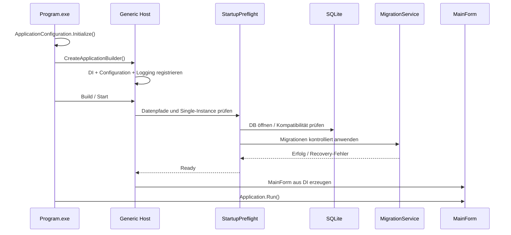

## 9.2 Startup-Phasen

1. WinForms-Bootstrap und DPI/Theme-Konfiguration;
2. Single-Instance-Prüfung;
3. Generic Host erstellen;
4. lokale Datenpfade sicherstellen;
5. Logging initialisieren;
6. Konfiguration laden und validieren;
7. Datenbank öffnen;
8. App-/Schema-Kompatibilität prüfen;
9. ausstehende Migrationen kontrolliert anwenden;
10. Dokumentstore-Pfade sicherstellen;
11. MainForm erzeugen;
12. Shell anzeigen;
13. Dashboard im Hintergrund laden.

## 9.3 Recovery-Start statt beschädigter Normalbetrieb

Fehlschlägt Datenbanköffnung oder Migration, darf die normale Shell nicht so gestartet werden, als sei das System gesund. Stattdessen wird eine minimalistische Recovery-Oberfläche angeboten mit:

- Fehlerreferenz;
- App-/Schema-Version;
- Diagnoseexport;
- Backup-/Restore-Einstieg, sofern sicher möglich;
- Beenden.

Die Recovery-UI darf keine riskanten Schreibvorgänge in einen unbekannten Datenzustand durchführen.

## 9.4 Shutdown

Beim regulären Beenden:

1. Navigation blockieren;
2. Dirty-State aller offenen Editoren abfragen;
3. laufende abbrechbare Operationen canceln;
4. nicht abbrechbare Commit-Phase kontrolliert abschließen;
5. Presenter/Views disposen und Event-Abonnements lösen;
6. Host stoppen;
7. Logs flushen;
8. Prozess beenden.

## 9.5 Single Instance

Verbindliche V1-Strategie:

- benutzerspezifischer Named Mutex zur Erkennung der ersten Instanz;
- benutzerspezifische Named Pipe für validierte Aktivierungs-/Startargumente;
- zweite Instanz übergibt zulässige Argumente und beendet sich;
- erste Instanz bringt MainForm kontrolliert in den Vordergrund.

Der Pipe-Name muss pro Benutzer isoliert sein, z. B. über einen Hash aus Produkt-ID und User-SID. Beliebige Befehlsausführung über Pipe ist ausgeschlossen; nur explizit definierte Startargumente sind erlaubt.

---
# 10. WinForms-Präsentationsarchitektur

## 10.1 MainForm als Shell

`MainForm` ist ausschließlich Anwendungsrahmen. Sie übernimmt:

- Hauptnavigation;
- Titel-/Statusbereich;
- globalen Suchzugang;
- Einbettung der aktuellen Feature-View;
- Statusmeldungen;
- globale Tastenkürzel;
- Shutdown-Koordination.

`MainForm` darf nicht zu einem fachlichen Controller anwachsen. Insbesondere darf sie keine Bewerbungs-, Kontakt-, Datenbank-, Backup- oder Merge-Logik enthalten.

## 10.2 Top-Level-Navigation

Für V1 werden folgende Hauptbereiche vorgesehen:

1. **Heute / Dashboard**
2. **Bewerbungen**
3. **Stellen / Opportunities**
4. **Unternehmen**
5. **Kontakte**
6. **Aufgaben & Zusagen**
7. **Kalender / Interviews**
8. **Dokumente**
9. **Suche**
10. **Auswertung**
11. **Einstellungen / Daten & Wartung**

Die konkrete visuelle Navigation kann als linke Navigationsleiste, ToolStrip oder vergleichbares WinForms-Muster umgesetzt werden. Die fachliche Navigationsstruktur bleibt davon unabhängig.

## 10.3 Shell-Komponenten

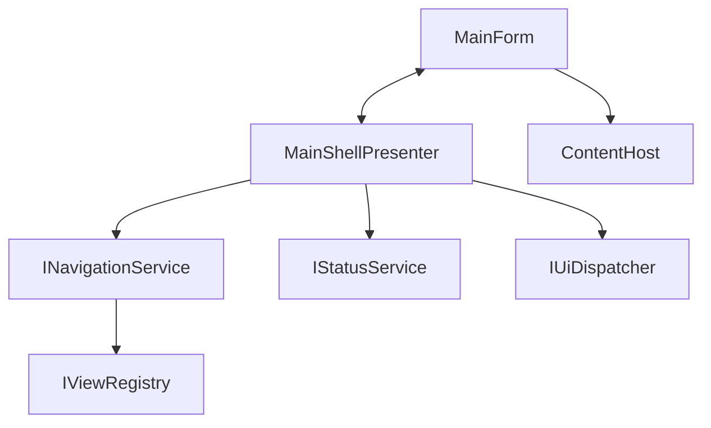

`IViewRegistry` kennt die Zuordnung von Navigation Targets zu View-/Presenter-Fabriken. Es ist kein allgemeiner Service Locator. Der Composition Root registriert diese Zuordnung explizit.

## 10.4 View-/Presenter-Vertrag

Größere Feature-Views erhalten eine schmale View-Schnittstelle. Beispielhaft:

```csharp
public interface IApplicationsView
{
    event EventHandler RefreshRequested;
    event EventHandler<ApplicationSelectedEventArgs> ApplicationSelected;
    event EventHandler CreateRequested;

    void ShowLoading();
    void ShowApplications(IReadOnlyList<ApplicationListItem> items);
    void ShowEmpty();
    void ShowError(UserFacingError error);
    void SetCommands(ApplicationCommandState state);
}
```

Der Presenter:

- abonniert View-Events;
- koordiniert Use Cases;
- hält nur UI-relevanten Zustand;
- kennt keine konkreten Controls;
- kennt kein `DbContext`;
- ruft keine statischen `MessageBox`-, `Process`- oder FileDialog-APIs direkt auf;
- ist deterministisch disposable und löst Event-Abonnements wieder.

## 10.5 Presenter-Lebensdauer

- Top-Level-Views: Presenter lebt so lange wie die View; bei View-Zerstörung Dispose.
- Modale Dialoge: Presenter transient pro Dialogöffnung.
- Wizards: ein Wizard-Presenter hält den Wizardzustand, nicht die Domain-Entitäten direkt.
- Keine statischen Presenter oder globalen View-Referenzen.

## 10.6 Navigation

Navigation besitzt einen einzigen Koordinator. Feature-Views dürfen Navigation anfordern, aber nicht selbst beliebige andere UserControls instanziieren.

Beispiel:

```text
ApplicationsPresenter
    -> INavigationService.OpenApplicationDetail(applicationId)
        -> ViewRegistry
        -> ApplicationDetailView + Presenter
        -> ContentHost
```

Dies verhindert direkte Form-zu-Form-Abhängigkeiten.

## 10.7 Dialogarchitektur

Wiederkehrende technische Dialoge werden über spezialisierte UI-Services abstrahiert:

- `IConfirmationService`;
- `IFilePickerService`;
- `IFolderPickerService`;
- `IExternalNavigationService`;
- `IClipboardService`;
- `IUserNotificationService`;
- `IProgressDialogService`.

Nicht zulässig ist ein allmächtiges `IUiService` mit beliebigen Methoden.

Fachlich umfangreiche Dialoge wie Merge, Import oder Restore erhalten eigene View/Presenter-Kombinationen und sind keine einfachen MessageBoxen.

## 10.8 UI-Zustandsmodell

Ladezustand und Bearbeitungszustand werden getrennt modelliert.

Beispiel:

```text
ContentState = Loading | Ready | Empty | Error
EditState    = Clean | Dirty | Saving | SaveFailed
Selection    = None | Selected(Id)
```

Dadurch entstehen keine widersprüchlichen Flagkombinationen wie `IsLoading=true` und `HasError=true` ohne definierte Bedeutung.

## 10.9 Dirty State

Ein Editor darf ungespeicherte Änderungen nicht verlieren. Vor:

- Navigation auf anderes Objekt;
- Wechsel des Hauptbereichs;
- Fenster schließen;
- Anwendung beenden;

wird eine definierte Dirty-State-Policy ausgeführt: **Speichern / Verwerfen / Abbrechen**.

Die Domain-Entität dient nicht als unkontrollierter Live-Bindungspuffer. Editoren arbeiten mit Edit Models und übertragen gültige Werte erst über einen Command in die Anwendungsschicht.

## 10.10 Datenbindung

WinForms-Datenbindung darf für einfache Anzeigen verwendet werden. Für komplexe fachliche Entitäten gilt:

- keine langfristige direkte Bindung eines EF-getrackten Objekts an Controls;
- Listen verwenden immutable/read-only Display Models;
- Editoren verwenden explizite Edit Models;
- Speichern erfolgt über Command, nicht über implizites `DbContext.SaveChanges()` aus Binding-Ereignissen.

## 10.11 Tastatur und Accessibility

Die Architektur behandelt Accessibility als UI-Qualität, nicht als nachträgliche Dekoration:

- sinnvolle Tab-Reihenfolge;
- Labels/Mnemonics;
- AccessibleName/AccessibleDescription, wo nötig;
- Status nicht ausschließlich über Farbe;
- Board-Aktionen zusätzlich per Tastatur/Menü;
- Fokus nach Navigation/Dialogabschluss vorhersehbar;
- Standardcontrols bevorzugen, weil sie bessere UI-Automation-/Accessibility-Unterstützung besitzen.

## 10.12 DPI und Theme

Die Anwendung nutzt die .NET-10-WinForms-Mechanismen für High DPI und Systemfarbmodus. Eigene Owner-Draw-Steuerelemente werden nur eingesetzt, wenn Standardcontrols den Zweck nicht erfüllen, da jedes Custom Drawing zusätzliche DPI-, Theme- und Accessibility-Verantwortung erzeugt.

---

# 11. Application Layer

## 11.1 Rolle

Die Application-Schicht definiert **Anwendungsfälle**, nicht allgemeine technische Services. Sie entscheidet beispielsweise:

- was beim Statuswechsel gemeinsam passieren muss;
- wann eine Next Action ersetzt werden darf;
- welche Daten ein Dashboard benötigt;
- wie ein Merge fachlich orchestriert wird;
- welche Prüfungen vor Restore oder Löschen nötig sind.

Sie entscheidet nicht:

- welche WinForms-Controls verwendet werden;
- wie SQL formuliert ist;
- wie Dateien physisch im Dateisystem benannt werden;
- wie ein MessageBox-Dialog aussieht.

## 11.2 Leichtgewichtiges CQRS

Commands und Queries werden getrennt modelliert, aber **ohne** verteiltes CQRS, Message-Broker oder getrennte Datenbanken.

### Command

Ein Command verändert Zustand.

Beispiele:

- `CreateApplicationCommand`;
- `ChangeApplicationStatusCommand`;
- `SetNextActionCommand`;
- `CreateCommitmentCommand`;
- `ImportDocumentVersionCommand`;
- `MergeCompaniesCommand`;
- `ArchiveApplicationCommand`.

### Query

Eine Query liest und projiziert Daten ohne fachliche Schreibwirkung.

Beispiele:

- `GetTodayDashboardQuery`;
- `SearchApplicationsQuery`;
- `GetApplicationDetailQuery`;
- `GetTimelineQuery`;
- `GetAnalyticsSummaryQuery`.

## 11.3 Kein MediatR-Zwang

V1 benötigt keine Drittanbieter-Mediatorbibliothek. Commands/Queries sind normale Records/Klassen und werden durch klar registrierte Handler oder Feature-Application-Services verarbeitet.

Ein möglicher interner Vertrag:

```csharp
public interface ICommandHandler<TCommand, TResult>
{
    TResult Handle(TCommand command, CancellationToken cancellationToken);
}

public interface IQueryHandler<TQuery, TResult>
{
    TResult Handle(TQuery query, CancellationToken cancellationToken);
}
```

Ob die konkrete Schnittstelle synchron oder task-basiert ist, hängt von der Operation ab. Wichtig ist die in Kapitel 19 beschriebene SQLite-Threading-Strategie: bloßes `async` erzeugt bei Microsoft.Data.Sqlite keine echte asynchrone I/O.

## 11.4 Result-Modell

Erwartete Nicht-Erfolgsfälle werden nicht über Exceptions gesteuert.

```text
Result<T>
├── Success(T)
├── ValidationFailure(errors)
├── Conflict(code, message)
├── NotFound(id)
├── Cancelled
└── TechnicalFailure(reference)   // erst an technischer Grenze erzeugt
```

Exceptions bleiben außergewöhnlichen technischen Fehlern vorbehalten. Die Application-Schicht übersetzt bekannte Infrastructure-Probleme an einer klaren Grenze in sichere, klassifizierbare Ergebnisse.

## 11.5 Validierungsebenen

### UI-Validierung

Sofortiges Feedback, z. B. Pflichtfeld leer oder URL syntaktisch ungültig.

### Application-Validierung

Use-Case-Voraussetzungen, z. B. Zielobjekt vorhanden, Merge-Ziele verschieden, Importstruktur gültig.

### Domain-Validierung

Invarianten, z. B. höchstens eine aktuelle Next Action, Outcome nur in gültigem Zustand, unveränderliche DocumentVersion.

### Datenbank-Constraints

Letzte Schutzlinie für referenzielle Integrität, Eindeutigkeit und Nullfähigkeit.

Keine Ebene ersetzt die jeweils andere.

## 11.6 Transaktionsgrenze pro Command

Ein Command besitzt genau eine dokumentierte Konsistenzgrenze. Mehrere fachlich zusammengehörige DB-Änderungen werden in einer gemeinsamen SQLite-Transaktion geschrieben.

Beispiele siehe Anhang C.

## 11.7 Read Models

Listen- und Dashboardabfragen liefern **Read Models**, keine vollständigen Domain-Aggregate.

Beispiel `ApplicationListItem`:

```text
ApplicationId
CompanyName
Title
CurrentStatus
Priority
NextActionText
NextActionDueDate
LastActivityAt
InterviewAt
IsArchived
```

Damit kann EF direkt auf die benötigten Spalten projizieren und muss keine großen Graphen materialisieren.

## 11.8 Feature-orientierte Ports

Die Application-Schicht hängt nicht an einem generischen Repository. Stattdessen verwendet sie Ports mit klarer Verantwortung, beispielsweise:

- `IApplicationWriteStore`;
- `IApplicationQueries`;
- `ICompanyWriteStore`;
- `IContactQueries`;
- `IDocumentStore`;
- `IBackupStore`;
- `IExportWriter`;
- `ISearchIndex`;
- `IClock`;
- `IFileSystem` nur dort, wo ein abstrakter Dateisystemvertrag fachlich/technisch nötig ist.

Ports sollen nicht jede EF-Funktion verstecken. Query-Ports dürfen bewusst use-case-spezifische Projektionen anbieten.

## 11.9 Zeit als Abhängigkeit

Fachliche Logik darf nicht überall direkt `DateTimeOffset.Now` oder `DateTime.UtcNow` verwenden. Ein `IClock` ermöglicht reproduzierbare Tests für:

- Überfälligkeit;
- Heute-Dashboard;
- Follow-up-Fristen;
- Commitment-Fälligkeiten;
- Zeitstempel.

---

# 12. Domänenarchitektur

## 12.1 DDD pragmatisch statt dogmatisch

Die Anwendung besitzt eine echte Domäne mit Invarianten, benötigt aber kein komplexes taktisches DDD-Framework. Der Begriff „Aggregate“ wird nur dort verwendet, wo eine transaktionale Konsistenzgrenze tatsächlich sinnvoll ist.

Wichtig: Die Datenbankstruktur ist nicht automatisch das Domänenmodell, und nicht jede Tabelle muss ein Aggregate Root sein.

## 12.2 Kernobjekte

### Company

Langfristiges Stammdatenobjekt. Besitzt Name, Webadresse, Ort, Branche, Typ, Notizen und Archivstatus. Eine Company besitzt nicht als eingebetteten Objektgraphen alle Applications und Contacts.

### Contact

Eigenständige Person. Kann einem Unternehmen zugeordnet und mit mehreren Vorgängen verknüpft sein. Kontaktdaten werden als Value Objects modelliert, soweit Validierung und Semantik dies rechtfertigen.

### Opportunity

Berufliche Chance unabhängig von einer einzelnen Anzeige. Kapselt Stelle, Unternehmen, Arbeitsmodell, Beschäftigungsart, Vergütungshinweise, Priorität und Notizen.

### JobPosting

Historischer Snapshot einer konkreten veröffentlichten Stellenanzeige. Nach Capture ist der Rohsnapshot unveränderlich; Korrekturen oder neue Anzeigen erzeugen einen neuen Snapshot.

### Application

Konkrete Bewerbung auf eine Opportunity. Enthält aktuellen Status, Bewerbungsdatum, Priorität, Outcome und Referenz auf aktuelle Next Action.

### Activity

Historisches Timeline-Ereignis. Grundsätzlich append-orientiert; Korrekturen werden bewusst nachvollziehbar vorgenommen.

### Communication

Strukturierte Kommunikationsdetails zu einer Activity. Kein eigenständiger E-Mail-Client in V1.

### Task

Eigene Arbeit des Benutzers.

### NextAction

Genau der wichtigste nächste Schritt oder bewusste Wartezustand einer aktiven Bewerbung.

### Commitment

Zusage/Versprechen eines Dritten. Besitzt eigenen Status und History und wird nicht automatisch zur Task.

### Interview

Gesprächsrunde mit Teilnehmern, Vorbereitung, Fragen, Learnings und Follow-up.

### Document / DocumentVersion

`Document` ist die logische Unterlage, `DocumentVersion` der unveränderliche Binärstand.

### SourcedStatement

Quellenbezogene Aussage mit Thema, Wert, Quelle und Zeitpunkt. Widersprüche werden nicht überschrieben.

## 12.3 Transaktionale Konsistenzgrenzen

Für V1 gelten folgende praktische Aggregate-/Konsistenzgrenzen:

| Root/Use Case | Gemeinsam konsistent zu halten |
|---|---|
| Application | aktueller Status, StatusHistory, statusbezogene Activity |
| Application / NextAction | bisherige Current-NextAction beenden, neue Current-NextAction setzen |
| Commitment | Status + CommitmentHistory + optionale Timeline-Activity |
| Company-Merge | Referenzen aller betroffenen Objekte auf Ziel-Company umhängen |
| Contact-Merge | Referenzen aller betroffenen Objekte auf Ziel-Contact umhängen |
| DocumentVersion-Import | Metadaten + physische Datei über Staging-Protokoll konsistent machen |
| Restore | gesamter Datenbestand als Betriebszustand |

Es wird **nicht** verlangt, dass eine `Application` zum Bearbeiten sämtliche Activities, Tasks, Interviews und Dokumente als riesigen In-Memory-Graph lädt.

## 12.4 Fachliche Invarianten

Mindestens:

1. `Application` verweist genau auf eine `Opportunity`.
2. Eine aktive Application besitzt höchstens eine aktuelle Next Action.
3. Ein Statuswechsel erzeugt StatusHistory und eine entsprechende Timeline-Activity in derselben DB-Transaktion.
4. Ein Outcome beendet die Bewerbung fachlich, löscht aber keine Historie.
5. Eine verwendete DocumentVersion ist inhaltlich unveränderlich.
6. Ein JobPosting-Snapshot wird nicht durch spätere Notizen überschrieben.
7. Commitment und Task bleiben unterschiedliche Typen.
8. Widersprüchliche SourcedStatements dürfen parallel existieren.
9. Ein Interview gehört genau zu einer Application, besitzt aber beliebig viele Teilnehmer.
10. Merge darf keine verwaisten Fremdschlüssel hinterlassen.
11. Archivierung ist reversibel und darf fachliche Historie nicht entfernen.
12. Endgültiges Löschen muss vorher seine Auswirkungen bestimmen.

## 12.5 Value Objects

Value Objects sollen eingesetzt werden, wenn sie echte Invarianten kapseln, z. B.:

- `EmailAddress`;
- `WebUrl` oder `ExternalUrl`;
- `MoneyRange`;
- `CompensationPeriod`;
- `DateRange`;
- `DocumentHash`;
- `ApplicationPriority`;
- `PersonName` nur, wenn dadurch tatsächlicher Nutzen entsteht.

Keine Wrapperklasse nur zur Erhöhung der Typzahl.

## 12.6 Domain Events

V1 verwendet **keinen allgemeinen Domain-Event-Bus**. Ein Domain Event kann intern als Rückgabewert einer Domain-Operation nützlich sein, wenn es die Fachlogik klarer macht, beispielsweise `ApplicationStatusChanged`. Die Application-Schicht orchestriert daraus aber explizit StatusHistory und Activity.

Es gibt:

- keine asynchrone Eventverarbeitung;
- keine eventual consistency innerhalb des lokalen Kerns;
- kein Event Replay;
- kein Outbox-Pattern in V1.

---

# 13. Persistenzarchitektur

## 13.1 Warum SQLite

SQLite passt zum V1-Betriebsmodell, weil:

- Einzelbenutzer und lokale Datenhaltung;
- kein Datenbankserver erforderlich;
- Transaktionen und referenzielle Integrität vorhanden;
- einfache Backup-/Portabilitätsmöglichkeiten;
- Datenmenge weit unter typischen SQLite-Grenzen;
- geringe Betriebs- und Installationskomplexität.

SQLite wird nicht als „provisorische Datenbank“ behandelt. Schema, Migration, Indizes und Restore werden produktionsnah gepflegt.

## 13.2 DbContext-Lebensdauer

Ein `BewerbungsmanagerDbContext` ist **kurzlebig und use-case-bezogen**.

Verboten:

- ein DbContext für die gesamte MainForm-Lebensdauer;
- DbContext als Singleton;
- EF-getrackte Entities dauerhaft in UI-Controls halten;
- DbContext zwischen Threads teilen.

Bevorzugt:

- Context pro Command oder Query;
- Erstellung über `IDbContextFactory<BewerbungsmanagerDbContext>` in Infrastructure;
- unmittelbares Dispose nach Use Case.

## 13.3 Schreiben

Schreibvorgänge verwenden:

1. eigenen DbContext;
2. explizite Transaktion bei mehrschrittigen Änderungen;
3. Domain-/Application-Prüfungen;
4. `SaveChanges` innerhalb der definierten Konsistenzgrenze;
5. klaren Fehler- und Rollbackpfad.

## 13.4 Lesen

Read-Queries:

- `AsNoTracking()`;
- direkte Projektion auf DTO/Read Model;
- serverseitige Filterung und Sortierung;
- Paging oder Begrenzung;
- keine unnötigen `Include()`-Graphen;
- gezielte Indizes.

## 13.5 GUID-Speicherung

V1 legt stabile `Guid`-IDs in SQLite in einer explizit dokumentierten kanonischen Textdarstellung ab. Ziel ist Portabilität und einfache Diagnose statt minimaler Speicheroptimierung. Das Format darf innerhalb V1.x nicht stillschweigend geändert werden.

## 13.6 Zeitmodell und SQLite-Limitierung

Im Domain-/Application-Code können exakte Zeitpunkte als `DateTimeOffset` repräsentiert werden. Persistiert werden exakte Zeitpunkte jedoch **normalisiert als UTC-`DateTime`/ISO-UTC-Wert**, weil der EF-Core-SQLite-Provider für `DateTimeOffset` bei Sortierung/Vergleich Einschränkungen besitzt.

Fachliche reine Tage, etwa Bewerbungsdatum oder Fälligkeit ohne Uhrzeit, werden als `DateOnly` bzw. ISO-Datum gespeichert und nicht durch Zeitzonen transformiert.

## 13.7 Geldmodell

Strukturierte Geldwerte werden als Ganzzahl in definierter kleinster Einheit plus ISO-Währungscode gespeichert. Dadurch werden `decimal`-Vergleichs-/Sortierprobleme des SQLite-Providers und binäre Gleitkommafehler vermieden.

## 13.8 Pragmas

Zielkonfiguration für V1:

- `foreign_keys = ON`;
- `journal_mode = WAL`;
- `synchronous = FULL` für starke lokale Dauerhaftigkeit;
- `busy_timeout` bzw. Provider-Timeout im Bereich weniger Sekunden, initial 5 Sekunden;
- Integritätsprüfungen in Wartungs-/Restorepfaden.

Die finalen Werte werden durch ADR und Integration-/Performance-Tests bestätigt. Eine Änderung darf Datenintegrität nicht gegen marginale Benchmarkgewinne eintauschen.

## 13.9 Write-Serialisierung

Obwohl nur ein UI-Prozess aktiv ist, können Hintergrundoperationen parallel entstehen. V1 serialisiert **fachliche Schreib-Commands** über einen pro Prozess zentralen Write Coordinator (`SemaphoreSlim` oder äquivalente Implementierung).

Ziele:

- weniger `SQLITE_BUSY`-Situationen;
- vorhersehbare Transaktionsreihenfolge;
- einfachere Maintenance-/Backup-Sperren;
- ausreichend für das geringe lokale Schreibvolumen.

Reads dürfen parallel laufen, solange keine Maintenance-Operation exklusiven Zugriff benötigt.

## 13.10 Datenbankschema

Das Pflichtenheft definierte folgende Kernbereiche; die Architektur übernimmt sie:

```text
Companies ──< Contacts
    │
    └──< Opportunities ──< JobPostings
                         └──< Applications
                                ├──< ApplicationStatusHistory
                                ├──< Activities ──0..1 Communications
                                ├──< Tasks ──< TaskChecklistItems
                                ├──< NextActions
                                ├──< Commitments ──< CommitmentHistory
                                ├──< Interviews ──< InterviewParticipants >── Contacts
                                ├──< ApplicationDocuments >── DocumentVersions >── Documents
                                └──< SourcedStatements
```

Die genaue FK-/Delete-Policy wird pro Beziehung explizit konfiguriert. Kritische historische Daten verwenden in der Regel `Restrict`/kontrolliertes Löschen statt unkontrollierter Cascade-Deletes.

## 13.11 Löschregeln

- Lookupwert mit Historienreferenz: nicht löschen, sondern deaktivieren.
- Company/Contact mit Referenzen: nur kontrollierter Merge oder Impact-geprüftes Delete.
- Application: Archivierung bevorzugt; endgültiges Löschen nur über Lösch-Use-Case.
- DocumentVersion: wenn historisch verwendet, nicht überschreiben; physische Löschung nur wenn keine fachliche Referenz mehr besteht und Retention-Regel dies erlaubt.

## 13.12 Migrationen

- jede Schemaänderung als versionierte EF-Core-Migration;
- `EnsureCreated()` nicht als Upgradeweg;
- Migrationen gegen repräsentative DB-Snapshots vorheriger V1.x-Versionen testen;
- destruktive Schritte benötigen explizite Datenübernahme oder vorheriges Backup;
- SQLite-Table-Rebuild-Besonderheiten werden in Migrationstests berücksichtigt;
- Migrationsstatus wird vor normalem UI-Start geprüft.

Da SQLite idempotente Migrationsskripte nur eingeschränkt unterstützt und EF Core für SQLite eigene Locking-Mechanismen nutzt, wird die Anwendung nicht auf generische Server-DB-Migrationsannahmen aufgebaut.

## 13.13 Abgebrochene Migration

Ein Crash während einer Migration kann einen ungewöhnlichen Zustand hinterlassen. V1 benötigt deshalb:

- Erkennung fehlgeschlagener/inkonsistenter Migration;
- Diagnose der Schema- und Migrationsversion;
- kein endloses Hängen ohne Benutzerinformation;
- dokumentierte Recoveryprozedur für einen verwaisten `__EFMigrationsLock`-Zustand;
- Wiederherstellung aus Pre-Migration-Backup als sicherer Standardweg.

---
# 14. Dokument- und Dateispeicherarchitektur

## 14.1 Grundsatz

Bewerbungsrelevante Dateien werden nicht ausschließlich über externe Pfade referenziert. Eine Datei, die historisch relevant ist – insbesondere ein tatsächlich versendeter Lebenslauf oder ein Anschreiben – wird als **verwaltete DocumentVersion** in den lokalen Document Store übernommen.

## 14.2 Trennung von logischem Dokument und Binärinhalt

```text
Document
├── Id
├── Name / Kategorie
└── DocumentVersions
      ├── Version A -> ContentHash H1
      ├── Version B -> ContentHash H2
      └── Version C -> ContentHash H3

Content Store
├── H1 -> Binärdatei
├── H2 -> Binärdatei
└── H3 -> Binärdatei
```

Zwei fachlich verschiedene DocumentVersions dürfen denselben Binärhash besitzen. Physische Deduplikation verändert deshalb nicht die fachliche Versionshistorie.

## 14.3 Content-addressed Storage

Empfohlene Ablage:

```text
%LOCALAPPDATA%\SASD\Bewerbungsmanager\documents\objects\
  ab\
    cd\
      abcdef...<sha256>
```

Der physische Pfad wird aus dem SHA-256-Hash abgeleitet. Der ursprüngliche Dateiname ist Metadatum und nicht vertrauenswürdiger Bestandteil des Speicherpfads.

Vorteile:

- keine Kollision durch Dateinamen;
- einfache Integritätsprüfung;
- Deduplikation;
- sichere Trennung von Benutzerdateinamen und interner Ablage;
- Backupmanifest kann Dateien eindeutig adressieren.

## 14.4 Importprotokoll

Ein Dokumentimport überquert zwei Ressourcen: Dateisystem und SQLite. Eine echte ACID-Transaktion über beide existiert nicht. V1 verwendet daher ein robustes Staging-Protokoll.

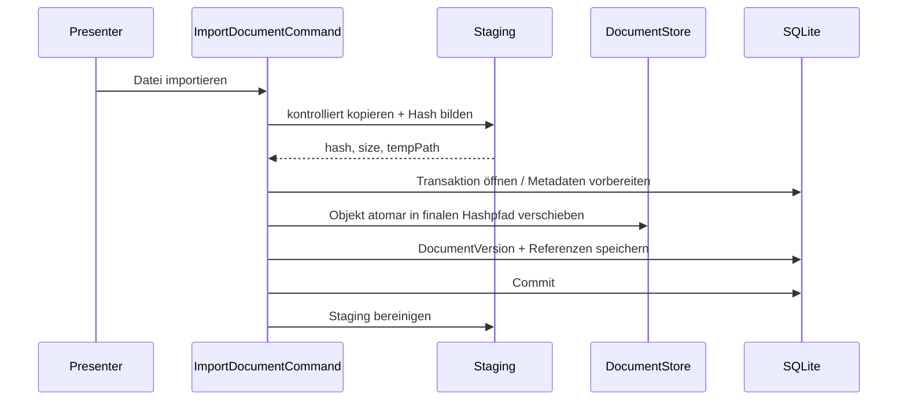

Wenn der Datenbankcommit nach erfolgreicher Dateiverschiebung fehlschlägt, kann eine **verwaiste physische Datei** entstehen. Das ist sicherer als eine DB-Referenz auf eine nicht vorhandene Datei. Verwaiste Objekte werden durch einen Wartungs-/Cleanup-Scan identifiziert und erst nach sicherer Referenzprüfung entfernt.

## 14.5 Dateiintegrität

Jede DocumentVersion speichert mindestens:

- SHA-256;
- Dateigröße;
- ursprünglichen Dateinamen;
- MIME-/Dateityphinweis, sofern bestimmbar;
- Importzeitpunkt;
- fachlichen Dokumenttyp.

Bei Öffnen oder Integritätsprüfung kann der Hash erneut validiert werden. Ein Hashfehler wird als Datenintegritätsproblem gemeldet; die Bewerbung selbst bleibt lesbar.

## 14.6 Unveränderlichkeit

Eine DocumentVersion, die in `ApplicationDocuments` als verwendet/versandt referenziert ist, darf niemals durch einen neuen Binärinhalt überschrieben werden. Änderungen erzeugen eine neue Version.

## 14.7 Öffnen importierter Dateien

- nur nach expliziter Benutzeraktion;
- mit dem unter Windows registrierten Handler;
- keine automatische Makro-/Skript-Ausführung durch die Anwendung;
- Pfad wird aus internem Hashstore bestimmt, nicht aus untrusted Originalnamen;
- Sicherheitswarnungen des Zielprogramms werden nicht umgangen.

## 14.8 Fehlende Dateien

Fehlt eine Content-Datei:

- Metadaten bleiben erhalten;
- betroffene Version wird als `Missing`/`IntegrityProblem` angezeigt;
- andere Bewerbungsdaten bleiben nutzbar;
- Diagnose benennt DocumentVersion-ID und Hash, nicht vertraulichen Inhalt;
- Restore oder erneute Zuordnung kann angeboten werden.

---

# 15. Sucharchitektur

## 15.1 Ziel

Die globale Suche soll Unternehmen, Kontakte, Stellen, Bewerbungen, Aktivitäten, Commitments und relevante Textfelder übergreifend auffindbar machen, ohne jeden großen Datensatz vollständig in den Arbeitsspeicher zu laden.

## 15.2 Primär- und Sekundärindex

Die relationale SQLite-Datenbank ist die Primärquelle. Ein Volltextindex ist **sekundär und wiederaufbaubar**.

```text
Primärdaten in SQLite
    │
    ├── strukturierte Filter -> SQL-Indizes
    │
    └── textuelle Inhalte -> ISearchIndex
                                └── bevorzugt SQLite FTS5, ADR vor M4
```

## 15.3 Architekturvertrag

`ISearchIndex` kapselt nur Volltextfunktionalität:

- Dokument aufnehmen/aktualisieren;
- Dokument entfernen;
- Suche mit Ranking;
- vollständiger Rebuild;
- Capability-/Health-Check.

Normale relationale Filter werden nicht künstlich durch den Volltextindex geleitet.

## 15.4 Suchdokument

Ein Suchdokument enthält mindestens:

- EntityType;
- EntityId;
- Titel;
- kurze kontextuelle Felder;
- indexierbaren Text;
- optionale Filterattribute.

Der Index darf sensible Bewerbungsinhalte enthalten, bleibt jedoch im lokalen Benutzerprofil und wird wie die Primärdaten geschützt.

## 15.5 Konsistenzstrategie

V1 benötigt keine verteilte Indexkonsistenz. Bevorzugt:

1. DB-Änderung erfolgreich committen;
2. Index synchron/kurz danach aktualisieren;
3. bei Indexfehler technischen Fehler protokollieren, Primärdaten nicht zurückrollen;
4. Index als „rebuild required“ markieren;
5. Rebuild aus SQLite anbieten/automatisch durchführen.

Damit ist der Index bewusst **derived state**.

## 15.6 FTS5-Entscheidung

FTS5 ist die bevorzugte V1-Lösung, weil sie lokal und ohne zweiten Server funktioniert. Vor M4 wird per ADR geprüft:

- verfügbare SQLite-Build-Features im ausgelieferten Provider;
- Tokenizer-/deutsche Suchanforderungen;
- Größe und Performance mit Referenzbestand;
- Backup-/Rebuild-Verhalten.

Falls FTS5 nicht ausreichend ist, bleibt die `ISearchIndex`-Grenze bestehen.

---

# 16. Backup-, Restore-, Export- und Importarchitektur

## 16.1 Unterschied Backup vs. Export

**Backup** dient vollständiger Wiederherstellung des Produkts.  
**Export** dient Datenhoheit, Lesbarkeit und Weiterverarbeitung.

Diese Zwecke werden nicht vermischt.

## 16.2 Backupformat

Logischer Container:

```text
backup.sasdbm-backup
├── manifest.json
├── database.db
├── documents/
│   └── objects/...
└── integrity.json
```

`manifest.json` enthält:

- Backupformat-Version;
- Produkt-ID;
- App-Version;
- Schema-Version;
- Erstellungszeit UTC;
- Datensatzstatistik;
- Dokumentobjektliste;
- Verschlüsselungsmetadaten, falls verschlüsselt.

`integrity.json` enthält SHA-256-Prüfsummen der logisch enthaltenen Komponenten bzw. des unverschlüsselten Nutzinhalts vor Containerverpackung.

## 16.3 Konsistentes SQLite-Backup

Eine aktive SQLite-Datei wird nicht blind per `File.Copy` gesichert. Infrastructure verwendet die SQLite-Online-Backup-Funktion des Providers (`SqliteConnection.BackupDatabase`) oder eine gleichwertig getestete SQLite-konforme Strategie.

Da diese Backupoperation konkurrierende Writes blockieren kann, wird sie mit dem globalen Write-/Maintenance-Coordinator verbunden.

## 16.4 Backupablauf

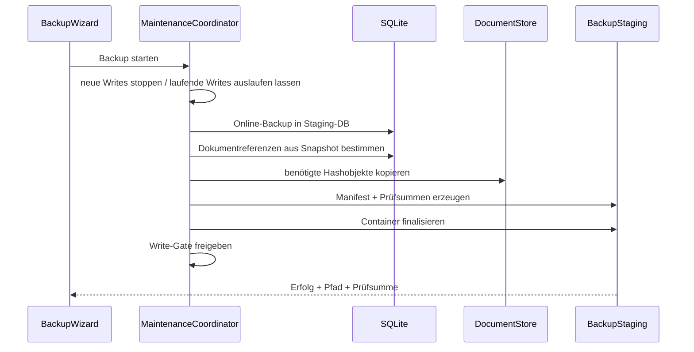

Wichtig ist, dass die Dokumentliste aus dem gesicherten Datenstand bestimmt wird und nicht aus einem zeitlich späteren, bereits veränderten Livezustand.

## 16.5 Backup-Verschlüsselung

Optional verschlüsselte Backups bleiben V1-Sollumfang. Architekturvorgabe:

- authentifizierte Verschlüsselung;
- passwortbasierte Schlüsselableitung über etablierten KDF;
- eindeutiges Format mit Version und Parametern;
- kein selbst erfundener Kryptografiealgorithmus;
- Passwort nicht persistieren;
- Manipulation vor Restore erkennen;
- bekannte Testvektoren und Negativtests.

Die konkrete Kombination aus KDF/Container wird per Security-ADR festgelegt.

## 16.6 Restore als Staging-Operation

Restore ersetzt niemals den Livebestand direkt aus dem geöffneten Archiv.

Phasen:

1. Backup auswählen;
2. Containerstruktur validieren;
3. Pfade normalisieren und Traversal verhindern;
4. Integrität prüfen;
5. ggf. Passwort und Authentizität prüfen;
6. App-/Format-/Schema-Kompatibilität prüfen;
7. aktuellen Livebestand automatisch sichern, sofern Benutzer nicht bewusst verzichtet;
8. Zielbestand vollständig in separatem Staging-Verzeichnis herstellen;
9. Staging-DB öffnen, migrieren falls unterstützt, Foreign Keys/Integrität prüfen;
10. Dokumenthashes validieren;
11. laufende Datenoperationen beenden;
12. Liveverzeichnis atomar/rollbackfähig umschalten;
13. Anwendung neu initialisieren oder neu starten;
14. alten Bestand erst nach Erfolg als Recovery-Kopie behandeln.

## 16.7 Atomarer Bestandswechsel

Windows-Dateisystemoperationen über ganze Verzeichnisse sind nicht in jedem Szenario vollständig atomar. Deshalb wird ein **generation-based data root** bevorzugt:

```text
data-root/
├── generations/
│   ├── g-20260824-001/
│   └── g-20260824-002/
└── current.json   -> aktive Generation-ID
```

Alternativ kann eine robuste Rename-/Replace-Strategie verwendet werden. Die endgültige Umsetzung wird in einem Restore-ADR festgelegt. Das Architekturziel bleibt: Ein Crash während der Umschaltung muss entweder den alten oder den neuen vollständigen Bestand wieder auffindbar lassen.

## 16.8 Offener Export

Export läuft aus Read Models/Exportprojektionen, nicht aus UI-Grids. Er enthält stabile IDs und explizite Formatversionen.

Standard:

- UTF-8;
- RFC-nahe CSV-Quoting-Regeln;
- ISO-Datumsformate;
- dokumentierte Null-/Listenrepräsentation;
- README mit Beziehungen;
- optional JSON-Gesamtformat.

## 16.9 CSV-Import

Import besitzt vier technische Stufen:

```text
Datei
  -> Parser
  -> Staging Records
  -> Mapping/Validation/Duplicate Analysis
  -> bestätigter Commit
```

Kein Parsercallback schreibt direkt produktive Entities.

Grenzen:

- Dateigrößenlimit;
- Zeilen-/Feldlängenlimit;
- kontrollierte Encoding-Erkennung;
- CSV-Injection-Risiken beim späteren Export berücksichtigen;
- Fehler je Zeile nachvollziehbar;
- Import kann vor Commit abgebrochen werden.

---

# 17. Fehlerbehandlungsarchitektur

## 17.1 Fehlerklassen

```text
ExpectedResult
├── ValidationFailure
├── BusinessConflict
├── NotFound
└── Cancelled

TechnicalFailure
├── PersistenceFailure
├── FileSystemFailure
├── ResourceExhaustion
├── BackupRestoreFailure
├── ImportExportFailure
└── UnexpectedFailure
```

## 17.2 Fehlergrenzen

### Domain

Keine technischen Exceptions als Fachsteuerung. Ungültige Domainoperationen liefern definierte Fehler oder werfen nur gezielte Domain-Exceptions, wenn eine Programmierschnittstelle grob falsch verwendet wurde.

### Application

Übersetzt bekannte fachliche Konflikte in `Result`. Definiert Benutzerwirkung, aber keine WinForms-Texte.

### Infrastructure

Fängt Provider-/Dateisystemexceptions nur dort, wo technische Klassifikation, Cleanup oder Übersetzung sinnvoll ist. Ursprüngliche Exception bleibt als Inner Exception erhalten, sofern Datenschutz dies erlaubt.

### Presentation

Übersetzt `Result`/klassifizierte Fehler in verständliche Meldung und Handlungsoption. Interne Exceptiontexte/Stacktraces werden nicht direkt angezeigt.

### Globale Fehlergrenze

Nur für unerwartete, nicht bereits behandelte Fehler. Sie protokolliert einmal mit Correlation ID und entscheidet, ob sicher weitergearbeitet werden kann.

## 17.3 Fehlerreferenz

Jeder unerwartete technische Fehler erhält eine kurze Fehlerreferenz, z. B.:

```text
BM-20260824-17A4F2
```

Diese verbindet Benutzerhinweis und lokales Log, ohne sensible Daten anzuzeigen.

## 17.4 Retry-Policy

Retries werden sparsam eingesetzt.

- `SQLITE_BUSY`/kurzzeitige Sperre: begrenzter Retry kann sinnvoll sein;
- fehlende Datei: kein Retry ohne neue Benutzeraktion;
- Validierungsfehler: niemals Retry;
- nicht-idempotenter Merge/Import: kein automatischer äußerer Retry;
- Backup-Dateiziel vorübergehend gesperrt: begrenzter Retry oder Benutzeroption.

Keine allgemeine „retry everything“-Policy.

## 17.5 Failure Injection

Für kritische Operationen werden Tests vorgesehen, die Fehler gezielt zwischen Schritten auslösen:

- Dokumentdatei kopiert, DB-Commit scheitert;
- DB-Backup erstellt, Dokumentkopie scheitert;
- Restore-Staging vollständig, Umschaltung scheitert;
- Merge nach Teiländerung wirft Exception;
- Datenträger voll während Export/Backup.

Ziel ist, Recoveryverhalten nachzuweisen, nicht nur Happy Paths.

---

# 18. Logging- und Diagnosearchitektur

## 18.1 Logging-Modell

`Microsoft.Extensions.Logging` bildet die zentrale Abstraktion. Ein lokaler File-Provider kann über eine kleine, geprüfte Drittbibliothek oder eine eigene begrenzte Implementierung ergänzt werden; die Abstraktion darf nicht durch konkrete Logbibliothekstypen bis in Domain/Application leaken.

## 18.2 Kategorien

- `Startup`;
- `Migration`;
- `Persistence`;
- `DocumentStore`;
- `BackupRestore`;
- `ImportExport`;
- `Search`;
- `Performance`;
- `UnhandledException`.

Fachliche Timeline-Activities sind **keine Logs**.

## 18.3 Strukturierte Logs

Beispiel:

```text
EventId: 3102
Category: BackupRestore
OperationId: <guid>
DurationMs: 1840
DatabaseBytes: 4213376
DocumentCount: 34
Result: Success
```

Nicht loggen:

- Lebenslauftext;
- vollständige Stellenanzeige;
- E-Mail-Inhalte;
- private Notizen;
- Backup-Passwort;
- vollständige Kontaktinformationen.

## 18.4 Correlation/Operation ID

Längere Operationen besitzen eine `OperationId`, die UI-Status, Log und Diagnosebericht verbindet. Das ist besonders nützlich für:

- Backup;
- Restore;
- Import;
- Export;
- Migration;
- Document Import;
- Merge.

## 18.5 Diagnosebericht

Diagnoseinformationen werden über einen separaten Builder erzeugt. Der Bericht enthält nur bekannte, redigierte Felder und ausgewählte Logs. Vor dem Speichern zeigt die UI Kategorien und Zeitraum.

## 18.6 Logrotation

- zeit- oder größenbasierte Rotation;
- begrenzte Aufbewahrung;
- keine unbegrenzten Debuglogs;
- Logverzeichnis liegt im Benutzerprofil;
- Cleanup-Fehler dürfen den normalen Start nicht verhindern.

---

# 19. Nebenläufigkeit, Threading und UI-Reaktionsfähigkeit

## 19.1 Zentrale Besonderheit von SQLite

`Microsoft.Data.Sqlite` bietet keine echte asynchrone SQLite-I/O; die ADO.NET-Async-Methoden laufen effektiv synchron. Deshalb wird nicht angenommen, dass `await dbContext.ToListAsync()` automatisch den UI-Thread freihält.

## 19.2 Threading-Regeln

1. WinForms-Controls nur vom UI-Thread verändern.
2. Kein `DbContext` zwischen Threads teilen.
3. Jeder Background-Datenvorgang erzeugt seinen DbContext im Background-Ausführungskontext.
4. Schreibcommands werden zusätzlich serialisiert.
5. `async void` nur in echten UI-Eventhandlern.
6. CancellationToken vom Presenter bis zur Operation durchreichen, wo Abbruch sicher möglich ist.
7. UI-Fortschritt über `IProgress<T>`/UI-Dispatcher gedrosselt melden.

## 19.3 Background Operation Runner

WinForms enthält einen Infrastruktur-nahen Präsentationsdienst `IBackgroundOperationRunner`. Er kapselt die bewusste Verlagerung blockierender lokaler Operationen vom UI-Thread.

Beispielvertrag:

```csharp
public interface IBackgroundOperationRunner
{
    Task<T> RunAsync<T>(
        Func<CancellationToken, T> operation,
        CancellationToken cancellationToken);
}
```

Die konkrete Implementierung darf `Task.Run` gezielt verwenden. Das ist **kein** Freibrief für beliebige Parallelisierung, sondern die definierte Grenze für blockierende SQLite-/Dateisystemarbeiten.

## 19.4 Warum nicht einfach überall Task.Run

`Task.Run` darf nicht tief in Domain oder Repository versteckt werden, weil dadurch:

- Threadbesitz unklar wird;
- DbContexts versehentlich threadübergreifend genutzt werden können;
- Cancellation/Progress schwer steuerbar wird;
- Tests nondeterministischer werden.

Die Verlagerung erfolgt an der UI/Application-Ausführungsgrenze.

## 19.5 Kurze vs. lange Operationen

### Kurz

- einzelne Detailabfrage;
- kleiner Statuswechsel;
- Task abhaken.

Auch diese sollen nicht unnötig lange UI blockieren, benötigen aber kein komplexes Fortschrittsdialogmodell.

### Lang

- Backup/Restore;
- großer Import/Export;
- Volltextindex-Rebuild;
- Dokumentintegritätsscan;
- große Merge-/Cleanup-Operation.

Diese erhalten:

- Background Runner;
- OperationId;
- Progress Model;
- Cancel bis Safe Commit Point;
- UI-Blocking der betroffenen Befehle;
- klare Abschlussmeldung.

## 19.6 Maintenance-Modus

Restore, Migration und bestimmte Wartungsoperationen benötigen Quieszenz.

`IMaintenanceCoordinator`:

1. markiert System als Maintenance Pending;
2. verhindert neue Schreiboperationsstarts;
3. fordert abbrechbare laufende Operationen zum Stop auf;
4. wartet auf aktive Schreiboperationen;
5. führt exklusive Operation aus;
6. initialisiert Ressourcen neu;
7. gibt System frei.

Während Maintenance zeigt die Shell einen eindeutigen Modus und deaktiviert normale Bearbeitung.

---
# 20. Security- und Privacy-Architektur

## 20.1 Schutzgüter

Zu schützen sind insbesondere:

- Bewerbungs- und Karrierehistorie;
- Namen und Kontaktdaten von Recruitern/Ansprechpartnern;
- private Notizen;
- Gehaltsangaben;
- Lebensläufe, Anschreiben, Zeugnisse;
- Gesprächsnotizen und persönliche Bewertungen;
- Backupinhalte;
- Integrität der historischen Daten.

## 20.2 Bedrohungsmodell V1

V1 ist eine lokale Einzelbenutzeranwendung. Hauptbedrohungen sind daher nicht verteilte Netzwerkangriffe, sondern:

- versehentliches Löschen/Überschreiben;
- manipulierte Import-/Backupdateien;
- Path Traversal / Zip Slip;
- bösartige oder aktive HTML-/Dokumentinhalte;
- Datenlecks über Logs/Diagnose;
- kompromittiertes Benutzerkonto oder unverschlüsselte Festplatte;
- beschädigte Migration/Restore;
- unsichere externe URL-Öffnung;
- ungewollte Ausführung fremder Dateien.

## 20.3 Trust Boundaries

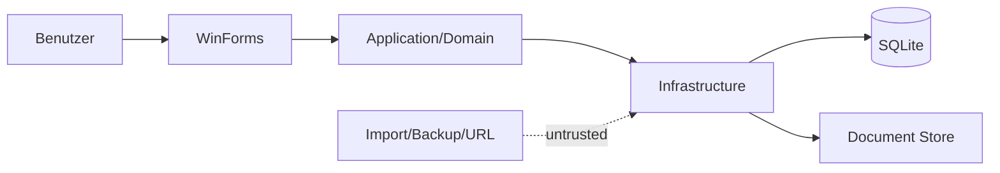

Die wichtigste Validierungsgrenze liegt zwischen externen/in Dateiform vorliegenden Daten und Infrastructure/Application.

## 20.4 Keine Netzabhängigkeit

Der V1-Kern registriert keinen generischen HTTP-Client für Produktfunktionen. Das verhindert unbeabsichtigte „später vielleicht“-Netzaufrufe. Wenn eine spätere Integration hinzukommt, erhält sie ein separates Projekt/Modul bzw. klaren Adapter und eine eigene Datenschutzbetrachtung.

## 20.5 Daten at Rest

Die Hauptdatenbank wird in V1 nicht mit anwendungseigener Datenbankverschlüsselung verschlüsselt. Begründung:

- Schlüsselmanagement bei einer rein lokalen Einzelbenutzeranwendung ist nicht trivial;
- ein im selben Benutzerprofil automatisch verfügbarer Schlüssel schützt nur eingeschränkt gegen ein bereits kompromittiertes Konto;
- Windows-/Datenträgerverschlüsselung ist für dieses Bedrohungsmodell die geeignetere Systemschicht.

Die Architektur verhindert aber nicht, später eine geprüfte Verschlüsselung einzuführen. Backups erhalten optional anwendungseigene Verschlüsselung, weil sie häufig auf externe Medien kopiert werden.

## 20.6 Input-Härtung

### Pfade

- alle Zielpfade kanonisieren;
- niemals `..` oder absolute Archivpfade aus Backup übernehmen;
- Extraktion immer unter kontrolliertem Staging-Root;
- Dateiname nicht als Autorisierungs-/Identitätsmerkmal verwenden.

### Archive

- Anzahl Einträge begrenzen;
- Gesamtgröße und entpackte Größe begrenzen;
- Kompressionsverhältnis prüfen, um Zip Bombs einzudämmen;
- Symlink-/Reparse-Point-Sonderfälle prüfen, soweit eingesetzte APIs dies zulassen.

### Text/HTML

- als Text speichern;
- keine aktiven WebBrowser-/WebView-Skripte zur Darstellung von Stellenanzeigen;
- HTML bei Anzeige sanitizen oder als Plain Text rendern.

### URLs

- unterstützte Schemas beschränken, primär `https`/`http`;
- `file:`, `javascript:` und unbekannte Protokolle nicht ungeprüft starten;
- Benutzeraktion erforderlich.

## 20.7 Secrets

V1 speichert keine E-Mail-/Cloudcredentials. Backup-Passwort:

- nur temporär im Prozess;
- nicht in Logs;
- nicht in settings.json;
- nicht als Commandline-Argument;
- soweit praktikabel Lebensdauer im Speicher begrenzen.

## 20.8 Least Privilege

- Normalbetrieb ohne Administratorrechte;
- Daten im Benutzerprofil;
- keine Windows-Dienste;
- keine globalen Hooks;
- keine Firewalländerungen;
- keine systemweiten Registrierungseinträge außer installerbedingt minimal erforderlichen.

## 20.9 Dependency Security

- zentrale Versionen über `Directory.Packages.props`;
- keine Pre-Release-Pakete in Production;
- direkte Dependencies minimieren;
- Lizenz- und Vulnerability-Prüfung vor Release;
- Paketwechsel als Reviewthema, wenn es Persistenz, Kryptografie, Parsing oder Dateiformate betrifft.

---

# 21. Performance- und Skalierungsarchitektur

## 21.1 Referenzlast

- 10.000 Opportunities/Bewerbungsvorgänge;
- 50.000 Activities;
- mehrere tausend Contacts/Companies;
- mehrere tausend Dokumentmetadaten;
- realistische Textmengen in JobPostings/Notes.

## 21.2 Zielwerte

- typische Listen-/Filteroperation: p95 ≤ 1 s;
- globale Standardsuche: p95 ≤ 2 s;
- Start bis bedienbare Shell/Dashboard: Ziel ≤ 5 s;
- UI darf bei normalen Vorgängen nicht sichtbar „einfrieren“.

## 21.3 Performanceprinzipien

1. Projektion statt Aggregategraph.
2. `AsNoTracking` für Reads.
3. Indizes auf Status, Datum, Fremdschlüssel, Due Dates und Normalized Names.
4. Paging / inkrementelles Nachladen.
5. keine Volltextsuche über `%LIKE%` auf allen großen Textspalten bei jedem Tastendruck.
6. Suchdebounce in UI.
7. schwere Dashboardkennzahlen bündeln statt N+1 Queries.
8. Dokumentbinärdaten niemals in SQLite-Listqueries laden.
9. keine Images/Dateivorschauen in großen Listen ohne Lazy Loading.

## 21.4 Dashboard

Das Dashboard ist eine zusammengesetzte Read Projection. Es darf mehrere gezielte Queries verwenden, soll aber keine vollständigen Applications materialisieren.

Datenbereiche:

- heute fällige Next Actions;
- überfällige Tasks;
- offene/überfällige Commitments;
- nächste Interviews;
- aktive Bewerbungen ohne Next Action;
- Warten-auf-Rückmeldung.

## 21.5 DataGridView

Für große Tabellen:

- feste Display Models;
- Paging 100–250 Zeilen;
- Sortierung in SQL;
- Filter in SQL;
- bei Bedarf VirtualMode erst nach Messung;
- keine AutoSize-Modi, die auf tausenden Zellen ständig teure Messungen ausführen.

## 21.6 Caching

V1 verwendet nur kleine, eindeutig invalidierbare Caches:

- Lookupwerte;
- UI-Ressourcen;
- ggf. zuletzt verwendete Filterdefinitionen.

Fachliche Kernobjekte werden nicht dauerhaft als globaler In-Memory-Cache gehalten. Dadurch bleibt die Datenbank die eindeutige Quelle und Memory-Verbrauch kontrollierbar.

---

# 22. Konfigurations- und Einstellungsarchitektur

## 22.1 Drei Konfigurationsklassen

### Build-/App-Defaults

`appsettings.json` im Installationsverzeichnis, nur nicht sensible technische Defaults.

### Benutzereinstellungen

`%LOCALAPPDATA%\SASD\Bewerbungsmanager\settings.json` für UI-/Benutzerpräferenzen.

### Fachliche Lookups

In SQLite, weil sie Bestandteil des Datenbestands und Exports/Backups sein können.

## 22.2 Beispiele Benutzereinstellungen

- Theme/Systemmodus;
- Fenstergröße/-position;
- bevorzugte Startansicht;
- Standardseitengröße;
- Datums-/Darstellungspräferenzen;
- ggf. letzter Exportordner;
- keine Passwörter.

## 22.3 Validierung

Konfiguration wird beim Start validiert. Eine beschädigte nicht kritische settings.json führt zu:

- sicherem Fallback auf Defaults;
- Logeintrag;
- optionaler Sicherung der beschädigten Datei;
- keinem Verlust der fachlichen Datenbank.

## 22.4 Versionsfähigkeit

Settings erhalten eine Formatversion, wenn spätere V1.x-Änderungen inkompatibel werden könnten. Kleine additive Einstellungen bleiben rückwärtskompatibel.

---

# 23. Installations-, Update- und Deploymentarchitektur

## 23.1 Deployment Unit

Ein self-contained `win-x64`-Release enthält:

- ausführbare Anwendung;
- .NET Runtime;
- notwendige native SQLite-Komponenten;
- Ressourcen;
- Konfiguration;
- Third-Party Notices;
- lokale Hilfe/Links;
- Versionsinformationen.

## 23.2 Installationsort vs. Datenort

Strikte Trennung:

```text
Installation:
%LOCALAPPDATA%\Programs\SASD\Bewerbungsmanager\  (Beispiel)

Daten:
%LOCALAPPDATA%\SASD\Bewerbungsmanager\
```

Ein Update des Programms darf den Datenordner nicht ersetzen oder löschen.

## 23.3 Updateprozess

V1.x-Update:

1. neue Anwendung installieren;
2. Start erkennt App-/Schema-Version;
3. Pre-Migration-Backup bei riskanter Migration;
4. Migration;
5. Schema-/Integritätscheck;
6. normaler Start.

Ein Binary-Downgrade auf eine Version, die das aktuelle Schema nicht versteht, wird erkannt und abgewiesen statt Daten mit unbekanntem Schema zu öffnen.

## 23.4 Deinstallation

Deinstallation entfernt standardmäßig **nicht** den Benutzerdatenbestand. Eine Datenlöschung ist eine separate, explizite Aktion mit deutlicher Warnung.

## 23.5 Code Signing

Die konkrete Signierungsstrategie bleibt ADR-/Releaseentscheidung. Architekturziel:

- Releaseartefakt eindeutig versioniert;
- SHA-256 veröffentlicht;
- Signierung bevorzugt, sobald organisatorisch möglich;
- Build-Pipeline dokumentiert Hash und Herkunft.

---

# 24. Testarchitektur

## 24.1 Testpyramide

```text
                ┌───────────────┐
                │ System / UI   │  wenige kritische End-to-End-Fälle
                ├───────────────┤
                │ Integration   │  SQLite, Files, Backup, Migration
                ├───────────────┤
                │ Application   │  Use Cases, Ports, Presenter
                ├───────────────┤
                │ Domain Unit   │  viele schnelle Fachregeltests
                └───────────────┘
```

## 24.2 Domain Tests

Ohne SQLite, WinForms oder echte Dateisysteme:

- Statusregeln;
- NextAction-Invariante;
- Commitmentstatus;
- Outcomes;
- Money/Date Value Objects;
- DocumentVersion-Unveränderlichkeit;
- sourced statements.

## 24.3 Application Tests

Mit Fakes/Stubs für Ports:

- Orchestrierung mehrerer fachlicher Schritte;
- Fehlerklassifikation;
- Validierung;
- Merge-Impact;
- Importstaging;
- Dashboardregeln;
- Zeitabhängigkeit via FakeClock.

## 24.4 Presenter Tests

Mit Fake Views und Fake Application Services/Handlern:

- Loading/Ready/Empty/Error;
- Command enable/disable;
- Dirty-State-Navigation;
- Fehlertexte/Notification-Entscheidung;
- Cancellation;
- Auswahlzustände.

Keine echte Form muss für diese Tests gestartet werden.

## 24.5 Infrastructure Integration Tests

Immer mit echter temporärer SQLite-Datei für providerabhängiges Verhalten:

- Foreign Keys;
- Transaktionen;
- Indizes;
- Zeit-/Geldkonvertierungen;
- Migrationen;
- Queryprojektionen;
- Merge;
- FTS falls eingesetzt;
- BackupDatabase-Roundtrip.

Der EF-InMemory-Provider ist kein Ersatz für diese Tests.

## 24.6 Document Store Tests

- Hashbildung;
- identische Inhalte;
- Staging;
- Abbruch/Failure Injection;
- Traversal-resistente Pfade;
- fehlende Objekte;
- Integritätsscan;
- Cleanup verwaister Objekte.

## 24.7 Backup/Restore Tests

Releasekritisch:

1. Datenbestand erzeugen;
2. Backup erstellen;
3. Original verändern oder entfernen;
4. Restore in isolierten Root;
5. Schema-/FK-/Hashprüfung;
6. fachliche Stichproben;
7. Vergleich erwarteter Zähler.

Negative Fälle:

- Hash manipuliert;
- Datei fehlt;
- ungültiges Manifest;
- Traversalpfad;
- falsches Passwort;
- inkompatible Backupformat-Version;
- Datenträgerfehler während Restore.

## 24.8 Migration Tests

Für jede freigegebene V1.x-Basis wird ein synthetischer Datenbanksnapshot aufbewahrt. CI testet:

- Startversion öffnen;
- auf Zielversion migrieren;
- Foreign Keys/Integrität;
- fachliche Referenzdaten;
- wiederholter Start nach Migration;
- erwartete Schema-Version.

## 24.9 System-/UI-Tests

Automatisieren nur kritische Pfade, z. B.:

- Anwendung startet;
- Bewerbung anlegen;
- Status ändern;
- Next Action setzen;
- Interview erfassen;
- Dokument importieren;
- Backup/Restore-Wizard;
- Tastaturpfad für zentrale Aktionen.

Die konkrete Automationstechnik wird per ADR ausgewählt.

## 24.10 Performance Tests

Eigenes Performance-Testprojekt erzeugt deterministische synthetische Daten und misst:

- Start;
- Anwendungsliste;
- Statusfilter;
- Dashboard;
- Timeline;
- globale Suche;
- Backup;
- Export.

Messungen werden nicht als flaky Merge-Gate auf beliebiger CI-Hardware verwendet. Für Release gibt es eine definierte Referenzmaschine/VM oder normalisierte Benchmarkumgebung.

---

# 25. Build-, CI- und Quality-Gate-Architektur

## 25.1 Reproduzierbarer Build

Ein frischer Checkout muss über dokumentierte CLI-Befehle baubar sein:

```text
dotnet restore
dotnet build -c Release --no-restore
dotnet test -c Release --no-build
dotnet publish ...
```

`global.json` fixiert die freigegebene SDK-Linie, ohne Security-/Patchupdates unnötig zu blockieren.

## 25.2 Zentrale Buildregeln

`Directory.Build.props` enthält u. a.:

- Nullable aktiv;
- Analyzer aktiv;
- Warnings-Konzept;
- deterministic build;
- SourceLink/Repository-Metadaten soweit sinnvoll;
- gemeinsame C#-Einstellungen.

`Directory.Packages.props` zentralisiert Paketversionen.

## 25.3 CI-Stufen

1. Restore;
2. Build;
3. Domain/Application Unit Tests;
4. Architecture Tests;
5. Infrastructure Integration Tests;
6. Migration Tests;
7. ausgewählte Systemtests;
8. Publish;
9. Artefakt-/Hash-Erzeugung;
10. Releasebericht.

## 25.4 Release Gates

V1.0 darf nicht freigegeben werden bei:

- fehlschlagenden Muss-Abnahmetests;
- fehlschlagendem Backup/Restore-Roundtrip;
- fehlschlagender Migrationssuite;
- bekannten Datenintegritätsfehlern;
- kritischen Securityproblemen;
- nicht dokumentierten Architekturabweichungen;
- nicht reproduzierbarem Releasebuild.

## 25.5 Architekturabweichungen

CI kann nicht jede Designregel erkennen. Code Reviews prüfen daher gezielt:

- Fachlogik in Forms;
- neue globale statische Zustände;
- DbContext-Lifetime;
- unkontrollierte `Task.Run`-Nutzung;
- sensible Logs;
- neue direkte Dateisystem-/Process-Aufrufe außerhalb Ports;
- neue Third-Party-Abhängigkeiten.

---

# 26. Erweiterbarkeitsarchitektur nach V1

## 26.1 Grundsatz

V1 wird nicht als Pluginplattform gebaut. Trotzdem werden technische Integrationen so geschnitten, dass neue Provider später außen ergänzt werden können.

## 26.2 E-Mail

Späterer Port beispielsweise:

```text
IMessageImportProvider
  -> liefert normalisierte MessageCandidate-Daten
  -> Application ordnet/prüft
  -> Benutzer bestätigt
  -> Communication/Activity entsteht
```

Gmail/IMAP-spezifische IDs oder OAuth-Tokens dürfen nicht in Domain-Entities leaken.

## 26.3 Kalender

```text
ICalendarProvider
  -> externe Termine lesen/schreiben
  -> Application mappt auf Interview/Appointment
```

Interne Interviews bleiben ohne Kalenderprovider vollständig nutzbar.

## 26.4 Jobquellen

```text
IJobSourceProvider
  -> JobPostingCandidate
  -> Normalisierung
  -> Dubletten-/Opportunity-Zuordnung
  -> Benutzerbestätigung
  -> JobPosting Snapshot
```

Damit kann später BA, Unternehmensseite oder anderer Provider ergänzt werden, ohne `Opportunity` zum Providerobjekt umzubauen.

## 26.5 KI

Optionale KI darf später nur über einen separaten Analyseport arbeiten. Sie darf:

- Vorschläge erzeugen;
- Text klassifizieren;
- Zusammenfassungen anbieten.

Sie darf nicht ohne explizite Produktentscheidung:

- Kernpersistenz ersetzen;
- Bewerbungen autonom absenden;
- Status ohne nachvollziehbare Quelle still verändern;
- sensible Daten ungefragt an Cloudanbieter übertragen.

## 26.6 Synchronisierung

Cloud-/Gerätesync wäre eine deutlich größere Architekturänderung, weil Konflikte, Identität, Verschlüsselung und Mehrschreiber hinzukommen. GUIDs und stabile Exporte erleichtern dies, aber V1 behauptet **nicht**, bereits sync-ready im Sinne gelöster Konfliktsemantik zu sein.

---
# 27. Architekturentscheidungen und ADR-Plan

## 27.1 Bereits verbindlich entschiedene Entscheidungen

| ID | Entscheidung | Status |
|---|---|---|
| AD-001 | Windows Forms auf .NET 10 LTS | verbindlich |
| AD-002 | modularer Monolith mit vier Hauptprojekten | verbindlich |
| AD-003 | MVP/Presenter für größere WinForms-Bereiche | verbindlich |
| AD-004 | leichtgewichtiges CQRS ohne getrennte Datenbanken | verbindlich |
| AD-005 | kein Event Sourcing / kein allgemeiner Message Bus | verbindlich |
| AD-006 | SQLite + EF Core 10 | verbindlich |
| AD-007 | kurzer DbContext pro Use Case | verbindlich |
| AD-008 | Write-Commands im Prozess serialisieren | verbindlich |
| AD-009 | GUIDs als stabile Identitäten | verbindlich |
| AD-010 | exakte Zeitpunkte in SQLite als UTC, fachliche Tage separat | verbindlich |
| AD-011 | verwalteter content-addressed Document Store | verbindlich |
| AD-012 | Backup mit SQLite-konformer Backupstrategie | verbindlich |
| AD-013 | Restore ausschließlich über Staging/Validierung | verbindlich |
| AD-014 | Named Mutex + Named Pipe für Single Instance | verbindlich |
| AD-015 | kein Netzwerkbedarf im V1-Kern | verbindlich |

## 27.2 Noch benötigte ADRs

### ADR-001 – Installer und Signing

Zu entscheiden:

- WiX, MSIX, Inno Setup oder anderer geeigneter Weg;
- per-user Installation;
- Code Signing;
- Upgradeverhalten.

Fällig: vor M5.

### ADR-002 – SQLite Detailkonfiguration

Zu bestätigen:

- WAL;
- `synchronous=FULL`;
- busy timeout;
- Connection Pooling;
- Integrity-Check-Policy.

Fällig: M0/M1.

### ADR-003 – Volltextsuche

FTS5 vs. Alternative; Tokenisierung, Rebuild und Performance.

Fällig: vor M4.

### ADR-004 – Backupverschlüsselung

- KDF;
- AEAD-Verfahren;
- Containerlayout;
- Versionsstrategie.

Fällig: vor M5.

### ADR-005 – Restore-Generation-Switch

Generation-based data root vs. robuste Rename/Replace-Strategie.

Fällig: vor M5.

### ADR-006 – UI-Automation

Technologie für systemnahe WinForms-Tests.

Fällig: M3/M4.

### ADR-007 – CSV-Parser

Eigene begrenzte Implementierung vs. gepflegte Bibliothek.

Fällig: vor CSV-Import.

### ADR-008 – File Logging Provider

Eigene minimale Implementierung vs. etablierter Provider.

Fällig: M0.

---

# 28. Bewusst verworfene Architekturalternativen

## 28.1 Microservices

**Verworfen**, weil lokaler Einzelbenutzerbetrieb keinen Nutzen aus Netzwerkgrenzen, Deployment mehrerer Prozesse, Distributed Transactions oder Service Discovery zieht. Die zusätzliche Fehlerfläche wäre unverhältnismäßig.

## 28.2 Lokaler ASP.NET-Core-Backenddienst plus WinForms-Frontend

**Verworfen**. Ein lokales HTTP-Backend würde Ports, Authentisierung, Prozessmanagement und zusätzliche Fehlerfälle erzeugen, ohne V1-Fachnutzen. Application und Infrastructure können direkt im Desktopprozess sauber getrennt werden.

## 28.3 Alles in einem WinForms-Projekt

**Verworfen**, weil Pflichtenheft und SASD-Desktopstandard testbare Trennung verlangen. Die Domäne ist umfangreich genug für dedizierte Application-/Domain-/Infrastructure-Schichten.

## 28.4 Repository pro Entität + Generic Repository

**Verworfen**. Ein universelles CRUD-Repository verschleiert use-case-spezifische Queries, Transaktionsgrenzen und EF-Fähigkeiten. V1 verwendet Feature-Ports und gezielte Read Projections.

## 28.5 Event Sourcing

**Verworfen**. Obwohl Historie wichtig ist, braucht das Produkt keine Rekonstruktion des gesamten aktuellen Zustands aus Events. Explizite History-/Timeline-Tabellen erfüllen die Nachvollziehbarkeit mit geringerem Betriebs- und Migrationsrisiko.

## 28.6 MediatR / Message Bus als Pflicht

**Verworfen** als Architekturzwang. Commands/Queries benötigen keine externe Dispatch-Bibliothek, solange Verantwortlichkeiten sauber bleiben. Eine spätere Einführung müsste messbaren Nutzen bringen.

## 28.7 SQLite-Binärdateien als BLOB für Dokumente

**Verworfen**. Große Dokumente würden DB-Größe, Backup, Queryverhalten und Recovery unnötig koppeln. Metadaten liegen in SQLite, Binärinhalte im verwalteten Hashstore.

## 28.8 Nur externe Dateipfade

**Verworfen**, weil historische Nachvollziehbarkeit verloren geht, wenn der Benutzer Dateien umbenennt, verschiebt oder überschreibt.

## 28.9 EF Core InMemory als primärer Persistenztest

**Verworfen**. Providerabhängige SQLite-Eigenschaften, Migrationen, Foreign Keys und Querybesonderheiten würden nicht realistisch geprüft.

## 28.10 Dauerhaft lebender DbContext

**Verworfen**. Er führt zu wachsendem Change Tracker, veralteten Entities, schlechter Threading-Sicherheit und schwerer testbarem UI-Verhalten.

## 28.11 Automatische DB-Verschlüsselung mit verstecktem lokalen Schlüssel

**Verworfen** für V1. Ohne sauberes Schlüsselmanagement wäre dies Scheinsicherheit. Schutz des Rechnerprofils bleibt Aufgabe von Windows/Datenträgerverschlüsselung; portable Backups können gezielt verschlüsselt werden.

---

# 29. Fehler-, Wiederanlauf- und Recovery-Szenarien

## 29.1 Strom-/Prozessabbruch beim normalen Speichern

Erwartung:

- SQLite-Transaktion ist entweder committed oder nicht committed;
- WAL/Full Synchronous schützt Konsistenz gemäß SQLite-Verhalten;
- App prüft beim nächsten Start normales Schema;
- keine halb geschriebenen fachlichen Mehrschrittvorgänge.

## 29.2 Prozessabbruch beim Dokumentimport

Mögliche Zustände:

1. nur Staging-Datei vorhanden → beim nächsten Cleanup entfernbar;
2. finales Hashobjekt vorhanden, aber keine DB-Referenz → orphan cleanup;
3. DB-Referenz committed → finales Objekt muss vorhanden sein; andernfalls Integritätsproblem sichtbar.

## 29.3 Datenträger voll

- Operation bricht mit Ressourcenfehler ab;
- kein stiller Teilcommit;
- Log enthält Pfadkategorie/OperationId, nicht sensible Inhalte;
- Benutzer bekommt Hinweis, Speicher freizugeben;
- Backup/Export-Staging wird soweit sicher bereinigt.

## 29.4 Beschädigte settings.json

- auf Defaults zurückfallen;
- Datei sichern/umbenennen;
- fachliche DB unberührt lassen.

## 29.5 Beschädigte SQLite-Datenbank

- normalen Schreibbetrieb nicht fortsetzen;
- Recovery-UI;
- Diagnose;
- Restore aus Backup als Standardempfehlung;
- keine automatische „Reparatur“, die Daten still verwirft.

## 29.6 Fehlgeschlagene Migration

- Anwendung startet nicht in Normalmodus;
- Pre-Migration-Backup bleibt verfügbar;
- Fehlerreferenz und Migrations-ID protokollieren;
- Recovery/Restore ermöglichen.

## 29.7 Fehlgeschlagener Backupvorgang

- Livebestand bleibt unverändert;
- unfertiges Backup erhält keine finale Dateiendung bzw. wird als `.partial` geführt;
- Staging wird bereinigt;
- kein „Backup erfolgreich“-Status ohne vollständige Hash-/Manifestprüfung.

## 29.8 Fehlgeschlagener Restore vor Umschaltung

- Livebestand bleibt unverändert;
- Stagingbestand kann für Diagnose erhalten oder bereinigt werden;
- kein Teilersatz.

## 29.9 Crash während Restore-Umschaltung

Generation-/Switch-Mechanismus muss beim nächsten Start erkennen können:

- gültige alte Generation;
- gültige neue Generation;
- welcher Pointer vollständig geschrieben wurde.

Im Zweifel wird nicht automatisch eine unbekannte Generation gewählt; Recovery-UI entscheidet anhand Manifest/Integrität.

## 29.10 Suchindex beschädigt

- fachliche Daten bleiben verfügbar;
- globale Volltextsuche meldet eingeschränkten Zustand;
- `Rebuild Search Index` stellt Funktion wieder her.

## 29.11 Dokumentdatei manuell gelöscht

- Metadaten/Timeline bleiben lesbar;
- fehlende Version wird markiert;
- Backup/Restore oder manuelle Wiederzuordnung möglich.

---

# 30. Deployment- und Betriebsansicht

## 30.1 Ein-Rechner-Betrieb

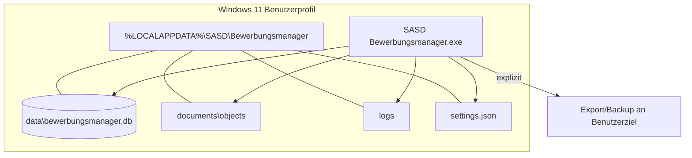

## 30.2 Keine Serverkomponenten

Es werden nicht installiert:

- Windows Service;
- SQL Server/LocalDB;
- IIS;
- Webserver;
- Docker;
- Hintergrunddaemon.

Dies reduziert Support- und Angriffsfläche.

## 30.3 Datenpfade

Verbindliches logisches Layout:

```text
%LOCALAPPDATA%\SASD\Bewerbungsmanager\
├── data\
│   └── bewerbungsmanager.db
├── documents\
│   └── objects\...
├── backups\
├── logs\
├── diagnostics\
├── staging\
├── cache\
└── settings.json
```

`staging` und `cache` gelten als wiederherstellbar/verwerfbar. `data`, `documents` und ggf. benutzerlokale Backups sind wertvolle Daten.

---

# 31. Datenklassifikation und Ownership

## 31.1 Klassen

| Klasse | Beispiele | Behandlung |
|---|---|---|
| P1 – hochsensibel | CV, Zeugnisse, private Notizen, Gesprächsnotizen | nicht loggen; in Backup einschließen; Export warnen |
| P2 – personenbezogen | Contact E-Mail/Telefon, Namen | minimiert loggen; Lösch-/Archivregeln |
| P3 – fachlich vertraulich | Gehalt, Priorität, Bewertung, Commitments | nicht unnötig diagnostizieren |
| P4 – öffentlich/gering | Stellen-URL, Firmenwebsite, Stellenanzeige | dennoch als Benutzerbestand behandeln |
| T – technisch | App-Version, Schema-Version, Duration | für Diagnose zulässig |

## 31.2 Datenverantwortung nach Schicht

| Datentyp | Owner | Andere Schichten |
|---|---|---|
| fachliche Invarianten | Domain | Application orchestriert |
| Use-Case-Ergebnis | Application | UI zeigt, Infrastructure liefert technische Daten |
| DB-Schema/Mappings | Infrastructure | Domain kennt sie nicht |
| Display-/Edit-State | WinForms | Application kennt Controls nicht |
| Dokumentbinärdatei | Infrastructure/DocumentStore | Application referenziert Version/Hash |
| Timelinefachlichkeit | Domain/Application | Infrastructure persistiert |
| Logs | Infrastructure/Host | Domain erzeugt keine sensiblen Logtexte |

---

# 32. Traceability vom Pflichtenheft zur Architektur

Das Pflichtenheft enthält 109 technische Pflichten. Die Architektur bildet sie in folgende Bereiche ab:

| Pflichtenbereich | Architekturkapitel |
|---|---|
| `PFL-BASE-*` | 3, 7, 9, 23, 25 |
| `PFL-ARCH-*` | 4–12, 26–28 |
| `PFL-UI-*` | 10, 19, 20, 24 |
| `PFL-DATA-*` | 12, 13, 21, 24 |
| `PFL-DOC-*` | 14, 16, 20, 24 |
| `PFL-SEC-*` | 16–20, 25 |
| `PFL-OPS-*` | 9, 16, 18, 23, 25, 29 |
| `PFL-TEST-*` | 8, 24, 25 |

## 32.1 Besondere Traceability-Ketten

### Statuswechsel

```text
Lastenheft: Statushistorie + Timeline
  -> Pflichtenheft PFL-DATA-006
  -> Architektur: Application Command + DB-Transaktion
  -> Domain: gültiger Statusübergang
  -> Infrastructure: Application + StatusHistory + Activity
  -> Tests: Unit + SQLite Integration + Systemtest
```

### Dokumentversion

```text
Lastenheft: exakt versendete Datei rekonstruieren
  -> PFL-DOC-001..005
  -> Architektur: Document + immutable DocumentVersion + SHA-256 store
  -> Staging-Protokoll
  -> Backup enthält Hashobjekt
  -> Restore validiert Hash
```

### Backup/Restore

```text
Lastenheft: Datenhoheit und Wiederherstellung
  -> PFL-OPS-001..005
  -> SQLite Online Backup + Document Manifest
  -> Staging Restore + Compatibility + Integrity
  -> Generation/Switch
  -> Release-Gate Roundtrip
```

---

# 33. Architektur-Roadmap und Implementierungsreihenfolge

## 33.1 M0 – Architecture Skeleton

Ziel: Architektur technisch erzwingen, bevor Fachcode wächst.

- Solution/Projekte;
- Projektabhängigkeiten;
- Generic Host;
- MainForm-Shell;
- DI;
- Logging-Grundgerüst;
- Datenpfade;
- SQLite/DbContextFactory;
- erste Migration;
- ArchitectureTests;
- Result/IClock-Grundtypen;
- Single-Instance-Grundlage.

**Exit:** Domain/Application ohne WinForms/EF; App startet mit leerer DB reproduzierbar.

## 33.2 M1 – Fachlicher Kern

- Company;
- Contact;
- Opportunity;
- JobPosting;
- Application;
- Read Models;
- Basis-CRUD über Commands/Queries;
- erste Presenter;
- Statusmodell;
- Migrationstests.

**Exit:** Bewerbung kann angelegt und als Akte geöffnet werden.

## 33.3 M2 – Prozesssteuerung

- Activities/Timeline;
- StatusHistory;
- NextAction;
- Tasks;
- Commitments;
- Dashboard;
- Due-Date-Queries;
- BackgroundOperationRunner.

**Exit:** „Was muss ich als Nächstes tun?“ ist produktiv beantwortbar.

## 33.4 M3 – Interviews und Dokumente

- Interviews;
- Participants;
- Questions/Learnings;
- Document/DocumentVersion;
- Hashstore;
- Staging-/Failure-Recovery;
- Dokumentintegritätstests.

**Exit:** Gesprächshistorie und tatsächlich verwendete Unterlagen sind rekonstruierbar.

## 33.5 M4 – Finden und Verstehen

- Board;
- globale Suche;
- gespeicherte Filter;
- Kalender;
- Analytics;
- FTS-ADR und SearchIndex;
- Performance-Tuning.

**Exit:** Referenzdatenbestand erfüllt Such-/Listen-Performanceziele.

## 33.6 M5 – Datenhoheit und Release

- Export;
- CSV-Import;
- Backup;
- verschlüsseltes Backup;
- Restore;
- Diagnose;
- Installer/Signing;
- vollständige Upgrade-/Restore-Suite;
- End-to-End-Abnahme.

**Exit:** V1.0 releasefähig.

---

# 34. Architektur-Review-Checkliste

Vor Merge größerer Änderungen ist proportional zu prüfen:

## Schichten

- [ ] Liegt Fachlogik außerhalb Forms/UserControls?
- [ ] Kennt Domain keine technische Infrastruktur?
- [ ] Kennt Application keine WinForms-Typen?
- [ ] Greift Presentation nicht direkt auf DbContext/SQL zu?

## Persistenz

- [ ] Ist der DbContext kurzlebig?
- [ ] Ist die Transaktionsgrenze klar?
- [ ] Werden Read Models statt großer Graphen geladen?
- [ ] Sind Foreign Keys/Constraints/Migration berücksichtigt?
- [ ] Ist SQLite-spezifisches Verhalten durch Integrationstest gedeckt?

## Threading

- [ ] Wird kein DbContext threadübergreifend geteilt?
- [ ] Blockiert eine längere lokale Operation nicht den UI-Thread?
- [ ] Ist Mehrfachausführung verhindert?
- [ ] Ist Cancellation bis zum Safe Commit Point korrekt?

## Dateien

- [ ] Werden untrusted Pfade normalisiert?
- [ ] Ist Staging/Cleanup definiert?
- [ ] Wird keine importierte Datei automatisch ausgeführt?
- [ ] Bleibt historische DocumentVersion immutable?

## Security/Privacy

- [ ] Werden sensible Inhalte nicht geloggt?
- [ ] Entsteht kein neuer versteckter Netzaufruf?
- [ ] Werden URLs/Archive/CSV als untrusted behandelt?
- [ ] Benötigt die Funktion keine unnötigen Adminrechte?

## Tests

- [ ] Domainregel durch Unit Test?
- [ ] Providerverhalten durch echte SQLite-Datei?
- [ ] Presenter ohne echte Form testbar?
- [ ] Fehler-/Recoverypfad getestet?
- [ ] Traceability zu PFL-/REQ-ID vorhanden?

---

# 35. Quellen und technische Referenzen

## 35.1 SASD Development Standard

- UI-Architektur für Desktopanwendungen:  
  https://github.com/Robin-Goerlach/SASD-Development-Standard/blob/main/docs/20-profiles/desktop/UI-ARCHITECTURE.md
- Persistenz in .NET:  
  https://github.com/Robin-Goerlach/SASD-Development-Standard/blob/main/docs/20-profiles/dotnet/PERSISTENCE.md
- Fehler- und Ausnahmebehandlung in .NET:  
  https://github.com/Robin-Goerlach/SASD-Development-Standard/blob/main/docs/20-profiles/dotnet/ERROR-HANDLING.md
- Application Lifecycle für Desktopanwendungen:  
  https://github.com/Robin-Goerlach/SASD-Development-Standard/blob/main/docs/20-profiles/desktop/APPLICATION-LIFECYCLE.md

Die aktuelle Approved-Baseline verlangt insbesondere die Trennung von UI, Fachlogik und Integrationen, testbare Application-/Domain-Dienste, kontrollierte Navigation, explizite UI-Zustände, Threading-Sicherheit sowie versionierte und testbare Persistenz-/Migrations- und Restore-Strategien.

## 35.2 Microsoft / .NET

- .NET Support Policy:  
  https://dotnet.microsoft.com/en-us/platform/support/policy/dotnet-core
- Generic Host in Windows Forms:  
  https://learn.microsoft.com/en-us/dotnet/desktop/winforms/advanced/how-to-use-host-builder
- EF Core mit WinForms und SQLite:  
  https://learn.microsoft.com/en-us/ef/core/get-started/winforms
- EF Core SQLite Provider Limitations:  
  https://learn.microsoft.com/en-us/ef/core/providers/sqlite/limitations
- Microsoft.Data.Sqlite – Async Limitations:  
  https://learn.microsoft.com/en-us/dotnet/standard/data/sqlite/async
- Microsoft.Data.Sqlite – Online Backup:  
  https://learn.microsoft.com/en-us/dotnet/standard/data/sqlite/backup
- Neuerungen in WinForms .NET 10:  
  https://learn.microsoft.com/en-us/dotnet/desktop/winforms/whats-new/net100
- Windows Forms Accessibility Improvements:  
  https://learn.microsoft.com/en-us/dotnet/desktop/winforms/windows-forms-accessibility-improvements

---

# Anhang A – C4-artige Architekturübersicht

## A.1 Kontext

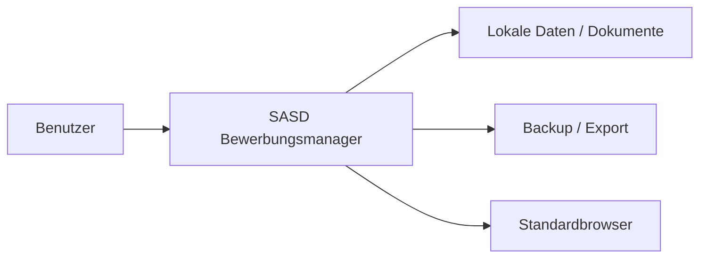

## A.2 Container

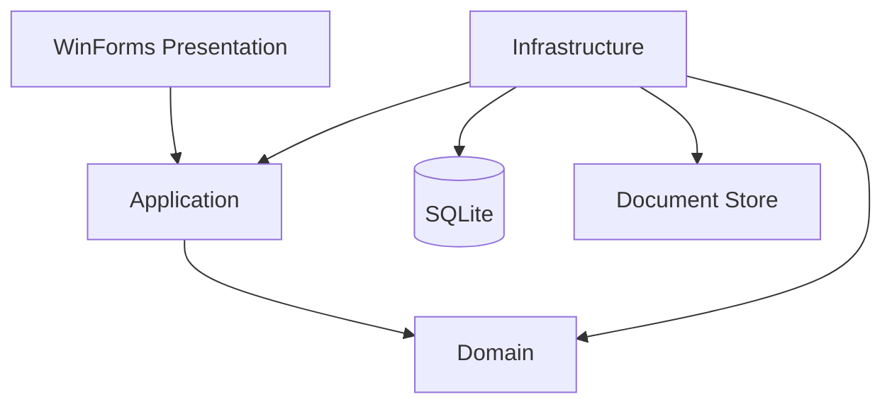

## A.3 Application Detail Use Case

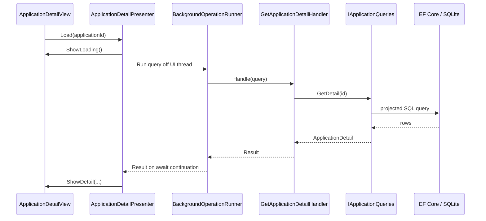

## A.4 Status Change

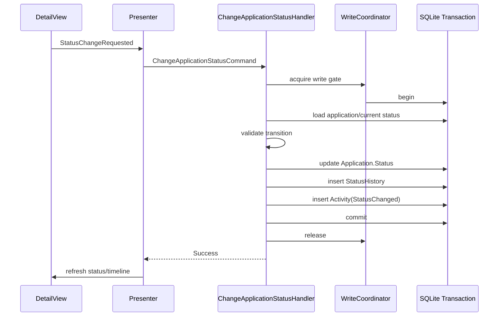

---

# Anhang B – Schlüsselverträge (konzeptionell)

Die folgenden Signaturen sind Architekturbeispiele, keine bindenden Copy-and-Paste-Implementierungen.

## B.1 Result

```csharp
public sealed record Result<T>(
    bool IsSuccess,
    T? Value,
    AppError? Error);

public sealed record AppError(
    AppErrorKind Kind,
    string Code,
    string UserMessage,
    string? TechnicalReference = null);
```

## B.2 Clock

```csharp
public interface IClock
{
    DateTimeOffset UtcNow { get; }
    DateOnly TodayLocal { get; }
}
```

## B.3 Queries

```csharp
public interface IApplicationQueries
{
    ApplicationDetail? GetDetail(Guid id, CancellationToken cancellationToken);
    PagedResult<ApplicationListItem> Search(
        ApplicationSearchFilter filter,
        PageRequest page,
        CancellationToken cancellationToken);
}
```

## B.4 Document Store

```csharp
public interface IDocumentStore
{
    StagedDocument StageImport(string sourcePath, CancellationToken cancellationToken);
    StoredDocument Commit(StagedDocument staged, CancellationToken cancellationToken);
    Stream OpenRead(DocumentHash hash);
    DocumentIntegrityResult Verify(DocumentHash hash);
}
```

## B.5 UI Dispatcher

```csharp
public interface IUiDispatcher
{
    bool CheckAccess();
    Task InvokeAsync(Action action, CancellationToken cancellationToken = default);
}
```

## B.6 Background Runner

```csharp
public interface IBackgroundOperationRunner
{
    Task<T> RunAsync<T>(
        Func<CancellationToken, T> operation,
        CancellationToken cancellationToken);
}
```

## B.7 External Navigation

```csharp
public interface IExternalNavigationService
{
    Result OpenHttpUrl(Uri uri);
}
```

---

# Anhang C – Transaktionsmatrix

| Use Case | DB-Transaktion | Dateisystem | Verhalten bei Fehler |
|---|---|---|---|
| Company anlegen | 1 | nein | Rollback |
| Application anlegen | 1 | nein | Rollback |
| Status ändern | 1: Application + History + Activity | nein | vollständiger Rollback |
| Next Action setzen | 1: alte beenden + neue setzen + Application ref | nein | vollständiger Rollback |
| Commitment Status ändern | 1: Commitment + History + ggf. Activity | nein | vollständiger Rollback |
| Interview speichern | 1: Interview + Teilnehmer + Fragen | nein | vollständiger Rollback |
| Company Merge | 1 über alle FK-Umschaltungen | nein | vollständiger Rollback |
| Contact Merge | 1 über alle FK-Umschaltungen | nein | vollständiger Rollback |
| Document importieren | 1 DB + Staging-Dateiprotokoll | ja | DB rollback; evtl. orphan object cleanup |
| Export | read snapshot/logische Reads | ja | Teilartefakt löschen/`.partial` |
| Backup | SQLite online backup + manifest | ja | Livebestand unverändert |
| Restore | Staging DB, kein direkter Livewrite | ja | Livebestand bis final switch unverändert |
| CSV Import | 1 oder bewusst gebatchte Transaktion nach Preview | Input read | bei Commitfehler konsistente Rücknahme |

---

# Anhang D – Daten-/Komponenten-Ownership

| Komponente | Darf lesen | Darf schreiben | Bemerkung |
|---|---|---|---|
| Domain | eigene Entities/Values | In-Memory-Domainzustand | keine technische Persistenz |
| Application Command Handler | Domain + Ports | über Write Ports/UoW | definiert Konsistenzgrenze |
| Application Query Handler | Read Ports | nein | liefert Read Models |
| EF Persistence | SQLite | SQLite | keine UI |
| Document Store | Hashstore | Hashstore | kennt keine Forms |
| Search Index | Primärdaten über Adapter | Sekundärindex | rebuildable |
| Presenter | Application Results | View State | keine DB |
| View | Display/Edit Models | UI State | keine Fachpersistenz |
| Backup Service | Snapshot DB + Document Store | Backupziel | Writegate/Maintenance |
| Restore Service | Backup/Staging | neue Generation | niemals direkt unvalidiert live |

---

# Anhang E – Architekturtestregeln

Mindestens folgende Tests sind als dauerhafte Guardrails vorzusehen:

1. `DomainAssemblyMustNotReferenceEntityFrameworkCore`;
2. `DomainAssemblyMustNotReferenceWindowsForms`;
3. `ApplicationAssemblyMustNotReferenceInfrastructure`;
4. `ApplicationAssemblyMustNotReferenceWindowsForms`;
5. `InfrastructureAssemblyMustNotReferenceWindowsForms`;
6. `PresentersMustNotReferenceDbContext`;
7. `FormsMustLiveInWinFormsAssembly`;
8. `EfMigrationsMustLiveInInfrastructure`;
9. `NoDirectMessageBoxOutsideUiServices` – soweit zuverlässig prüfbar;
10. `NoProcessStartOutsideExternalNavigationService` – soweit zuverlässig prüfbar.

Architekturtests sollen klein und stabil bleiben. Sie dürfen nicht zu fragilen Namenskonventionstests ausarten, die legitimes Refactoring verhindern.

---

# Anhang F – ADR-Template

```markdown
# ADR-NNN – Titel

- Status: Proposed | Accepted | Superseded | Rejected
- Datum: YYYY-MM-DD
- Entscheider:
- Betroffene Version:

## Kontext
Welches konkrete Problem muss entschieden werden?

## Entscheidungstreiber
- ...

## Betrachtete Optionen
### Option A
Vorteile / Nachteile

### Option B
Vorteile / Nachteile

## Entscheidung
Welche Option wird gewählt und warum?

## Konsequenzen
### Positiv
- ...

### Negativ / Kosten
- ...

## Risiken und Gegenmaßnahmen
- ...

## Nachweise
Tests, Benchmarks, Quellen, Prototypen.

## Traceability
Pflichten-/Requirement-IDs.
```

---

# Anhang G – Architektur-Definition-of-Done für V1.0

Die V1.0-Architektur gilt als umgesetzt, wenn mindestens:

- alle vier Hauptprojekte und Abhängigkeitsregeln existieren;
- ArchitectureTests grün sind;
- kein Kern-Use-Case Fachlogik in Forms enthält;
- DbContexts kurzlebig und nicht threadübergreifend sind;
- Statuswechsel, Next Action, Commitment und Merge atomar getestet sind;
- DocumentVersion-Hashstore und Failure-Recovery getestet sind;
- Migration von allen freigegebenen V1-Basen getestet ist;
- Backup/Restore-Roundtrip inklusive Dokumenten bestanden ist;
- manipulierte Backup-/Traversal-Fälle abgefangen werden;
- Suchindex vollständig rebuildbar ist, sofern eingesetzt;
- p95-Performanceziele mit Referenzbestand nachgewiesen sind;
- Installer/Upgrade/Deinstallation in sauberer Windows-11-VM geprüft sind;
- Logs keine bekannten sensiblen Vollinhalte enthalten;
- alle 15 Lastenheft-End-to-End-Abnahmefälle bestanden sind;
- offene Architekturabweichungen entweder geschlossen oder dokumentiert freigegeben sind.

---

# Schlussfolgerung

Die Zielarchitektur des SASD Bewerbungsmanagers V1.0 ist bewusst **konservativ in der Betriebsform und anspruchsvoll bei Datenintegrität und Nachvollziehbarkeit**. Ein einzelner Windows-Desktopprozess mit SQLite ist für den vorgesehenen Einzelbenutzerbetrieb die einfachste angemessene Lösung. Die Qualität entsteht nicht durch verteilte Infrastruktur, sondern durch saubere Grenzen:

- WinForms bleibt Präsentation;
- Application beschreibt Use Cases;
- Domain schützt fachliche Bedeutung;
- Infrastructure übernimmt technische Persistenz und Dateisysteme;
- SQLite ist Primärbestand;
- Dokumentversionen sind unveränderlich und gehasht;
- Suchindex/Caches sind wiederaufbaubar;
- Backup/Restore sind echte Architekturkomponenten;
- Historie ist explizit, aber nicht Event-Sourcing;
- Hintergrundausführung berücksichtigt die realen SQLite-Async-Grenzen;
- spätere Integrationen docken über Ports an, ohne den V1-Kern zu verbiegen.

Damit ist die Architektur klein genug, um mit WinForms und einem überschaubaren Team zuverlässig implementiert zu werden, zugleich aber strukturiert genug, um nicht nach wenigen Releases in einem untestbaren Form-/DbContext-Monolithen zu enden.

---

# Anhang H – Vollständige Traceability der technischen Pflichten
Dieser Anhang weist **jede im Pflichtenheft definierte technische `PFL-*`-Pflicht** einem oder mehreren Architekturkapiteln zu. Die Matrix ersetzt nicht die feinere Requirement→Code→Test-Traceability, stellt aber sicher, dass keine technische Pflicht bei der Architekturableitung verloren geht.

| Pflichten-ID | Kurzinhalt | Primäre Architekturkapitel |
|---|---|---|
| `PFL-BASE-001` | Die Produktivlösung MUSS C# und `net10.0-windows` verwenden. | 3, 7, 9, 23, 25 |
| `PFL-BASE-002` | Produktive V1.0-Releases MÜSSEN auf einer unterstützten .NET-10-LTS-Patchversion erzeugt werden. | 3, 7, 9, 23, 25 |
| `PFL-BASE-003` | Das Release MUSS für `win-x64` self-contained publiziert werden. | 3, 7, 9, 23, 25 |
| `PFL-BASE-004` | Nullable Reference Types MÜSSEN in allen neuen Produktprojekten aktiviert sein. | 3, 7, 9, 23, 25 |
| `PFL-BASE-005` | Der kanonische Build MUSS ohne nicht versionierte Visual-Studio-Einstellungen reproduzierbar sein. | 3, 7, 9, 23, 25 |
| `PFL-BASE-006` | Die Anwendung MUSS als Single-Instance pro Benutzerprofil betrieben werden. | 3, 7, 9, 23, 25 |
| `PFL-BASE-007` | Die Anwendung MUSS ohne externes Konto und ohne Netzwerkverbindung start- und kernnutzbar sein. | 3, 7, 9, 23, 25 |
| `PFL-BASE-008` | Produktionsdaten MÜSSEN im Benutzerprofil und nicht im Installationsverzeichnis liegen. | 3, 7, 9, 23, 25 |
| `PFL-BASE-009` | Deinstallation DARF Benutzerdaten nicht ohne separate ausdrückliche Entscheidung löschen. | 3, 7, 9, 23, 25 |
| `PFL-BASE-010` | Preview-SDKs, Preview-Sprachfeatures und Preview-NuGet-Pakete DÜRFEN NICHT in V1.0 gelangen. | 3, 7, 9, 23, 25 |
| `PFL-ARCH-001` | Die Solution MUSS die Projekte WinForms, Application, Domain und Infrastructure getrennt führen. | 4–13, 19, 26–28 |
| `PFL-ARCH-002` | Domain DARF NICHT von WinForms, EF Core oder Infrastructure abhängen. | 4–13, 19, 26–28 |
| `PFL-ARCH-003` | Application DARF NICHT von WinForms abhängen. | 4–13, 19, 26–28 |
| `PFL-ARCH-004` | Forms und UserControls DÜRFEN NICHT direkt auf `DbContext` zugreifen. | 4–13, 19, 26–28 |
| `PFL-ARCH-005` | Größere WinForms-Funktionsbereiche MÜSSEN Presenter oder gleichwertige Präsentationskomponenten besitzen. | 4–13, 19, 26–28 |
| `PFL-ARCH-006` | Presenter MÜSSEN Application Use Cases verwenden und DÜRFEN kein SQL enthalten. | 4–13, 19, 26–28 |
| `PFL-ARCH-007` | Der Composition Root MUSS zentral in Startup/Program liegen. | 4–13, 19, 26–28 |
| `PFL-ARCH-008` | Dependency Injection DARF NICHT über einen globalen Service Locator aus Views konsumiert werden. | 4–13, 19, 26–28 |
| `PFL-ARCH-009` | Fachliche Operationen MÜSSEN ohne gestartete vollständige WinForms-Anwendung testbar sein. | 4–13, 19, 26–28 |
| `PFL-ARCH-010` | Designer-generierter Code DARF NICHT mit Geschäftslogik vermischt werden. | 4–13, 19, 26–28 |
| `PFL-ARCH-011` | Navigation MUSS über einen zentralen NavigationService/Coordinator erfolgen. | 4–13, 19, 26–28 |
| `PFL-ARCH-012` | Modale Dialoge MÜSSEN einen begrenzten atomaren Zweck besitzen. | 4–13, 19, 26–28 |
| `PFL-ARCH-013` | Datei-, Backup- und Exportzugriffe MÜSSEN über Infrastructure-Services gekapselt sein. | 4–13, 19, 26–28 |
| `PFL-ARCH-014` | Zeitabhängige Fachlogik SOLL über eine injizierbare Clock-Abstraktion testbar sein. | 4–13, 19, 26–28 |
| `PFL-ARCH-015` | Dubletten-, Merge- und Delete-Impact-Operationen MÜSSEN als Application Use Cases implementiert sein. | 4–13, 19, 26–28 |
| `PFL-UI-001` | Die `MainForm` MUSS als Shell fungieren und DARF keine umfangreiche Geschäftslogik enthalten. | 10, 19–21, 24 |
| `PFL-UI-002` | Das Dashboard MUSS nach Start ohne zusätzliche Navigation erreichbar sein. | 10, 19–21, 24 |
| `PFL-UI-003` | Jede Hauptliste MUSS Detailakten per Enter/Doppelklick öffnen können. | 10, 19–21, 24 |
| `PFL-UI-004` | Statusinformationen DÜRFEN NICHT ausschließlich durch Farbe dargestellt werden. | 10, 19–21, 24 |
| `PFL-UI-005` | Kernansichten MÜSSEN bei 100–200 % Windows-Skalierung bedienbar bleiben. | 10, 19–21, 24 |
| `PFL-UI-006` | Hauptnavigation und Kerndatenerfassung SOLLEN vollständig per Tastatur möglich sein. | 10, 19–21, 24 |
| `PFL-UI-007` | Ungespeicherte Änderungen DÜRFEN bei Navigation/Schließen nicht still verloren gehen. | 10, 19–21, 24 |
| `PFL-UI-008` | Längere Operationen MÜSSEN einen sichtbaren Busy-/Fortschrittszustand besitzen. | 10, 19–21, 24 |
| `PFL-UI-009` | Nicht parallele Operationen MÜSSEN gegen unbeabsichtigte Mehrfachausführung geschützt sein. | 10, 19–21, 24 |
| `PFL-UI-010` | UI-Validierung MUSS feldnah erfolgen, DARF aber Domain-/Application-Validierung nicht ersetzen. | 10, 19–21, 24 |
| `PFL-UI-011` | Board-Statuswechsel MUSS neben Drag-and-drop einen tastatur-/menübasierten Weg besitzen. | 10, 19–21, 24 |
| `PFL-UI-012` | Destruktive Aktionen MÜSSEN textlich eindeutig von Archivierung und normalen Änderungen getrennt sein. | 10, 19–21, 24 |
| `PFL-UI-013` | Externe Links MÜSSEN vor dem Öffnen als externe Navigation erkennbar sein. | 10, 19–21, 24 |
| `PFL-UI-014` | Fehlermeldungen MÜSSEN Auswirkung und mögliche nächste Handlung nennen, soweit technisch bekannt. | 10, 19–21, 24 |
| `PFL-UI-015` | Die primäre UI-Sprache MUSS Deutsch sein; UI-Strings SOLLEN aus Ressourcen beziehbar sein. | 10, 19–21, 24 |
| `PFL-DATA-001` | Die produktive Persistenz MUSS SQLite über EF Core verwenden. | 12–13, 16, 21, 24 |
| `PFL-DATA-002` | SQLite Foreign Keys MÜSSEN aktiviert sein. | 12–13, 16, 21, 24 |
| `PFL-DATA-003` | Produktive Schemaänderungen MÜSSEN über versionierte EF-Core-Migrationen erfolgen. | 12–13, 16, 21, 24 |
| `PFL-DATA-004` | `EnsureCreated()` DARF NICHT als produktive Upgrade-Strategie verwendet werden. | 12–13, 16, 21, 24 |
| `PFL-DATA-005` | Kernobjekte MÜSSEN stabile interne GUID-Identitäten besitzen. | 12–13, 16, 21, 24 |
| `PFL-DATA-006` | Statusänderungen MÜSSEN Current Status, StatusHistory und Timeline konsistent aktualisieren. | 12–13, 16, 21, 24 |
| `PFL-DATA-007` | Archivierung MUSS reversibel sein und DARF Historie nicht löschen. | 12–13, 16, 21, 24 |
| `PFL-DATA-008` | Endgültiges Löschen MUSS einen vorab ermittelten Impact berücksichtigen. | 12–13, 16, 21, 24 |
| `PFL-DATA-009` | Company-/Contact-Merge MUSS in einer Datenbanktransaktion erfolgen. | 12–13, 16, 21, 24 |
| `PFL-DATA-010` | Historische JobPosting-Snapshots MÜSSEN getrennt von Benutzerannotation gespeichert werden. | 12–13, 16, 21, 24 |
| `PFL-DATA-011` | Widersprüchliche SourcedStatements MÜSSEN parallel persistierbar sein. | 12–13, 16, 21, 24 |
| `PFL-DATA-012` | Eine aktive Bewerbung DARF höchstens eine aktuelle Next Action besitzen. | 12–13, 16, 21, 24 |
| `PFL-DATA-013` | Commitments MÜSSEN von Tasks getrennt persistiert werden. | 12–13, 16, 21, 24 |
| `PFL-DATA-014` | Interviewteilnehmer MÜSSEN als n:m-Beziehung zu Contacts persistiert werden. | 12–13, 16, 21, 24 |
| `PFL-DATA-015` | Exakte Ereigniszeitpunkte MÜSSEN in UTC normalisiert gespeichert und lokal dargestellt werden. | 12–13, 16, 21, 24 |
| `PFL-DATA-016` | Reine Fälligkeitstage MÜSSEN ohne unbeabsichtigte Zeitzonenverschiebung als fachliche Tage gespeichert werden. | 12–13, 16, 21, 24 |
| `PFL-DATA-017` | Geldwerte DÜRFEN NICHT als binäre Fließkommazahl modelliert werden. | 12–13, 16, 21, 24 |
| `PFL-DATA-018` | Read-Listen MÜSSEN serverseitig filtern/sortieren und dürfen bei großen Beständen nicht unnötig Aggregate materialisieren. | 12–13, 16, 21, 24 |
| `PFL-DATA-019` | Referenzielle Integrität MUSS auch nach Upgrade, Merge, Archivierung und Restore erhalten bleiben. | 12–13, 16, 21, 24 |
| `PFL-DATA-020` | Der Volltextindex, sofern eingesetzt, MUSS aus Primärdaten vollständig neu aufbaubar sein. | 12–13, 16, 21, 24 |
| `PFL-DOC-001` | Eine für eine Bewerbung verwendete Datei MUSS als verwaltete DocumentVersion gespeichert werden. | 14, 16, 20, 24, 29 |
| `PFL-DOC-002` | DocumentVersions MÜSSEN einen SHA-256-Inhaltshash besitzen. | 14, 16, 20, 24, 29 |
| `PFL-DOC-003` | Eine bereits versandbezogen referenzierte DocumentVersion DARF inhaltlich nicht überschrieben werden. | 14, 16, 20, 24, 29 |
| `PFL-DOC-004` | Identische Binärdateien KÖNNEN physisch dedupliziert werden, fachliche Versionen MÜSSEN aber unterscheidbar bleiben. | 14, 16, 20, 24, 29 |
| `PFL-DOC-005` | Dateispeicheroperationen MÜSSEN Staging und Fehler-Cleanup verwenden. | 14, 16, 20, 24, 29 |
| `PFL-DOC-006` | Fehlende Dokumentdateien DÜRFEN den restlichen Datenbestand nicht blockieren. | 14, 16, 20, 24, 29 |
| `PFL-DOC-007` | Importierte Dokumente DÜRFEN NICHT automatisch ausgeführt werden. | 14, 16, 20, 24, 29 |
| `PFL-DOC-008` | Das Öffnen einer Datei MUSS eine explizite Benutzeraktion sein. | 14, 16, 20, 24, 29 |
| `PFL-DOC-009` | Dokumentmetadaten und Bewerbungszuordnung MÜSSEN im offenen Export nachvollziehbar sein. | 14, 16, 20, 24, 29 |
| `PFL-DOC-010` | Backup MUSS alle verwalteten Dokumentdateien oder eindeutig dokumentierte externe Abhängigkeiten enthalten. | 14, 16, 20, 24, 29 |
| `PFL-SEC-001` | Der V1-Kern DARF keine Telemetrie übertragen. | 16–20, 23, 25, 29 |
| `PFL-SEC-002` | Der V1-Kern DARF keine E-Mail-/Cloud-Credentials verlangen oder speichern. | 16–20, 23, 25, 29 |
| `PFL-SEC-003` | HTML-Stellenanzeigentext DARF NICHT in einem aktiven Script-Kontext ausgeführt werden. | 16–20, 23, 25, 29 |
| `PFL-SEC-004` | Datei- und Backup-Pfade MÜSSEN normalisiert und gegen Traversal geprüft werden. | 16–20, 23, 25, 29 |
| `PFL-SEC-005` | Logs DÜRFEN standardmäßig keine vollständigen Lebensläufe, E-Mails oder Stellenanzeigen enthalten. | 16–20, 23, 25, 29 |
| `PFL-SEC-006` | Backupcontainer MÜSSEN vor Restore auf Format, Pfade und Integrität validiert werden. | 16–20, 23, 25, 29 |
| `PFL-SEC-007` | Passwörter für verschlüsselte Backups DÜRFEN NICHT persistiert werden. | 16–20, 23, 25, 29 |
| `PFL-SEC-008` | Verschlüsselte Backups SOLLEN authentifizierte Verschlüsselung verwenden. | 16–20, 23, 25, 29 |
| `PFL-SEC-009` | Externe URLs DÜRFEN nur nach ausdrücklicher Benutzeraktion geöffnet werden. | 16–20, 23, 25, 29 |
| `PFL-SEC-010` | Die Anwendung SOLL ohne Administratorrechte im Normalbetrieb arbeiten. | 16–20, 23, 25, 29 |
| `PFL-SEC-011` | Diagnoseexport MUSS vor Erstellung/Weitergabe seinen Inhalt transparent machen. | 16–20, 23, 25, 29 |
| `PFL-SEC-012` | Importe MÜSSEN Größen- und Strukturgrenzen gegen Ressourcenmissbrauch berücksichtigen. | 16–20, 23, 25, 29 |
| `PFL-OPS-001` | Backup MUSS einen konsistenten SQLite-Datenbankstand enthalten. | 9, 16, 18, 23, 25, 29–30 |
| `PFL-OPS-002` | Backup MUSS Prüfsummen für enthaltene Komponenten besitzen. | 9, 16, 18, 23, 25, 29–30 |
| `PFL-OPS-003` | Restore MUSS zunächst in einem Staging-Bereich erfolgen. | 9, 16, 18, 23, 25, 29–30 |
| `PFL-OPS-004` | Ein fehlgeschlagener Restore DARF den vorherigen Datenbestand nicht zerstören. | 9, 16, 18, 23, 25, 29–30 |
| `PFL-OPS-005` | Vor riskanter Migration/Restore MUSS ein Backup angeboten oder automatisiert erstellt werden. | 9, 16, 18, 23, 25, 29–30 |
| `PFL-OPS-006` | Ein Update innerhalb V1.x DARF Benutzerdaten nicht löschen. | 9, 16, 18, 23, 25, 29–30 |
| `PFL-OPS-007` | Die Anwendung MUSS App- und Schema-Version diagnostizierbar machen. | 9, 16, 18, 23, 25, 29–30 |
| `PFL-OPS-008` | Logs MÜSSEN lokal rotiert und zeit-/größenbegrenzt aufbewahrt werden. | 9, 16, 18, 23, 25, 29–30 |
| `PFL-OPS-009` | Releaseartefakte MÜSSEN aus sauberem Checkout reproduzierbar erzeugt werden. | 9, 16, 18, 23, 25, 29–30 |
| `PFL-OPS-010` | Releaseartefakte MÜSSEN eine veröffentlichte kryptografische Prüfsumme besitzen. | 9, 16, 18, 23, 25, 29–30 |
| `PFL-OPS-011` | Installer, Upgrade und Deinstallation MÜSSEN in einer sauberen Windows-11-Testumgebung geprüft werden. | 9, 16, 18, 23, 25, 29–30 |
| `PFL-OPS-012` | Benutzerhilfe MUSS Backup, Restore, Export und endgültige Datenlöschung erklären. | 9, 16, 18, 23, 25, 29–30 |
| `PFL-TEST-001` | Domain-Kernregeln MÜSSEN automatisierte Unit Tests besitzen. | 8, 24–25, 34 |
| `PFL-TEST-002` | Persistenz und Migrationen MÜSSEN gegen echte temporäre SQLite-Dateien getestet werden. | 8, 24–25, 34 |
| `PFL-TEST-003` | Die Teststrategie DARF sich für SQLite-Verhalten nicht ausschließlich auf EF InMemory stützen. | 8, 24–25, 34 |
| `PFL-TEST-004` | Architekturgrenzen MÜSSEN automatisiert oder reproduzierbar geprüft werden. | 8, 24–25, 34 |
| `PFL-TEST-005` | Presenter kritischer Ansichten SOLLTEN ohne echte Forms testbar sein. | 8, 24–25, 34 |
| `PFL-TEST-006` | Alle 15 Lastenheft-Abnahmefälle MÜSSEN vor V1.0 bestanden sein. | 8, 24–25, 34 |
| `PFL-TEST-007` | AT-011, AT-014 und AT-015 MÜSSEN Release-Gates sein. | 8, 24–25, 34 |
| `PFL-TEST-008` | Performance MUSS mit synthetischem Referenzbestand von 10.000 Vorgängen/50.000 Aktivitäten gemessen werden. | 8, 24–25, 34 |
| `PFL-TEST-009` | Typische Filter-/Listenaktionen MÜSSEN im 95. Perzentil <= 1 s liegen. | 8, 24–25, 34 |
| `PFL-TEST-010` | Globale Standardsuche MUSS im 95. Perzentil <= 2 s liegen. | 8, 24–25, 34 |
| `PFL-TEST-011` | Programmstart SOLL mit Referenzbestand <= 5 s bis bedienbare Shell/Dashboardzustand erreichen. | 8, 24–25, 34 |
| `PFL-TEST-012` | Securitytests MÜSSEN mindestens Path Traversal, manipuliertes Backup, aktives HTML und Log-Leaks abdecken. | 8, 24–25, 34 |
| `PFL-TEST-013` | Migrationsreferenzdaten MÜSSEN pro freigegebener V1.x-Basis aufbewahrt werden. | 8, 24–25, 34 |
| `PFL-TEST-014` | Produktive Testdaten DÜRFEN keine realen Bewerbungs-/Personendaten enthalten. | 8, 24–25, 34 |
| `PFL-TEST-015` | Build, Unit-, Integration- und Architekturtests MÜSSEN im CI für Merge-/Releasepfade ausgeführt werden. | 8, 24–25, 34 |

**Nachgewiesene technische Pflichten:** 109 von 109 im Pflichtenheft erkannten `PFL-*`-Anforderungen.
