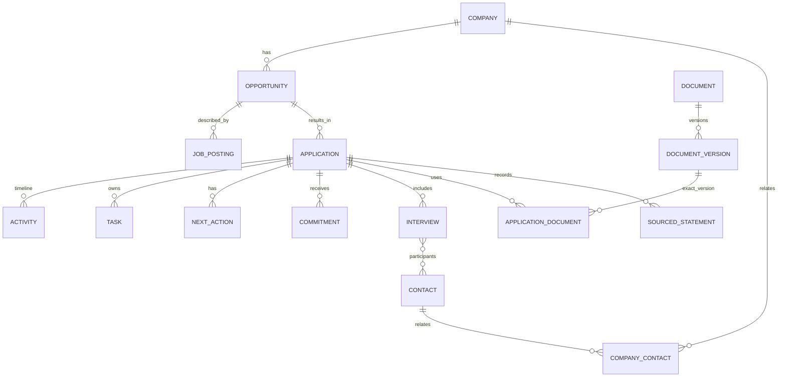

# Datenmodell – fachlich-technische Persistenzsicht

> **Status:** Implementierungsbaseline  
> **Dokumentversion:** 1.0  
> **Stand:** 2026-08-24  
> **Geltungsbereich:** Produktversion 1.0  
> **Projekt:** SASD Bewerbungsmanager


## 1. Grundsatz

Das Datenmodell optimiert auf **Nachvollziehbarkeit und langfristige Wartbarkeit**, nicht auf minimale Tabellenzahl. Fachlich unterschiedliche Konzepte bleiben getrennt, auch wenn sie ähnliche Felder besitzen.

SQLite ist Source of Truth für strukturierte Fachinformationen. Binäre Dokumentinhalte liegen außerhalb der DB in einem verwalteten, gehashten File Store.

## 2. Kernentitäten

| Entität/Tabelle | Verantwortung |
|---|---|
| `Companies` | Unternehmen/Stammdaten |
| `Contacts` | Personen/Recruiter/Fachkontakte |
| `CompanyContacts` | historische/mehrfache Unternehmenszuordnung |
| `Opportunities` | berufliche Chance unabhängig von Anzeige/Bewerbung |
| `JobPostings` | konkrete Anzeigen-Snapshots und Quellen |
| `Applications` | Bewerbungsprozess |
| `ApplicationStatuses` | Pipelinephasen |
| `ApplicationStatusHistory` | unverlierbare Übergangshistorie |
| `Activities` | Timeline-Ereignisse |
| `Communications` | strukturierte Kommunikationsdetails |
| `ActivityContacts` | Beteiligte an Aktivitäten |
| `Tasks` | eigene Aufgaben |
| `TaskChecklistItems` | Teilaufgaben |
| `NextActions` | wichtigster nächster Schritt/Wartezustand |
| `Commitments` | Zusagen Dritter |
| `CommitmentHistory` | Historie von Fälligkeit/Status |
| `Interviews` | Gesprächsrunden |
| `InterviewParticipants` | n:m Interview ↔ Kontakt |
| `InterviewQuestions` | Vorbereitung/Fragen |
| `Documents` | logisches Dokument |
| `DocumentVersions` | konkrete immutable Version |
| `ApplicationDocuments` | tatsächlich verwendete Versionen |
| `SourcedStatements` | Aussagen mit Quelle/Kontext |
| `Sources` | Portal/Recruiter/Unternehmensseite usw. |
| `Tags` + Links | flexible Kategorisierung |
| `SavedViews` | gespeicherte Filteransichten |
| Lookup-Tabellen | EmploymentType, WorkModel, Industry usw. |
| `SchemaInfo` | Schema-/Migrationsinformation |

## 3. Identitäten

Alle wesentlichen Fachobjekte verwenden `Guid` als stabile Identität. Die konkrete SQLite-Repräsentation (TEXT oder BLOB) wird im Persistenz-ADR festgeschrieben und danach innerhalb V1.x nicht geändert.

Keine Anzeigenummer, URL oder E-Mail-Adresse ist Primärschlüssel.

## 4. Zeitmodell

- fachliche reine Tage → `DateOnly`, ISO `YYYY-MM-DD`;
- Ereignisse → `DateTimeOffset` in Anwendung, normalisiert auf UTC gespeichert;
- `CreatedAtUtc` und `UpdatedAtUtc` zentral gesetzt;
- fachlicher Ereigniszeitpunkt darf vom technischen Erstellzeitpunkt abweichen;
- historische Werte werden nicht unbemerkt auf „jetzt“ überschrieben.

## 5. Geldmodell

Kein `double`. Strukturierte Vergütung besteht mindestens aus Betrag/Min/Max, ISO-4217-Währung und Bezugszeitraum. Freitext darf Sonderfälle ergänzen, ersetzt aber nicht strukturierte Werte, wenn diese bekannt sind.

## 6. Beziehungen



## 7. Zentrale Invarianten

1. Eine `Application` verweist auf genau eine Opportunity.
2. Ein Statuswechsel darf die History nicht umgehen.
3. Eine abgeschlossene Bewerbung darf kein implizit „aktives“ NextAction erzeugen.
4. Ein `Commitment` ist kein `Task`.
5. Eine `DocumentVersion` wird nach erfolgreichem Import nicht in-place verändert.
6. `ApplicationDocuments` verweist auf eine konkrete Version, nie nur auf `Document`.
7. `SourcedStatement` speichert Quelle/Kontext; konkurrierende Aussagen werden nicht automatisch überschrieben.
8. Archivieren ist reversibel; Löschen ist separat.
9. Merge darf keine verwaisten Fremdschlüssel erzeugen.
10. Derived Search State darf gelöscht und aus Fachdaten neu aufgebaut werden.

## 8. Löschen und Archivieren

Bevorzugt fachliche Archivierung statt Soft-Delete-Flag überall. Endgültiges Löschen ist ein Application-Use-Case mit Referenzanalyse und expliziter Benutzerbestätigung.

DB-Cascade wird nur dort eingesetzt, wo semantisch eindeutig ist, dass Child-Daten ohne Parent keinen Wert besitzen. Historie und verwendete Dokumentversionen werden nicht leichtfertig kaskadiert.

## 9. Dokumentstore

`DocumentVersion` speichert Metadaten:

- Hashalgorithmus und SHA-256;
- Länge;
- ursprünglicher Dateiname;
- Medien-/Dateityp;
- Importzeit;
- Storage Key/Pfad;
- Integritätsstatus.

Binärdateien liegen z. B. unter:

```text
%LOCALAPPDATA%\SASD\Bewerbungsmanager\documents\objectsb\cd\<sha256>
```

Der Dateiname ist nicht die fachliche Identität.

## 10. Indizes

Vorgesehen sind Indizes für häufige Filter/Joins:

- Company normalized name;
- Contact name/e-mail;
- Opportunity company/title/active;
- Application status/date/outcome/archive;
- NextAction due/status;
- Task due/status;
- Commitment due/status;
- Interview start;
- Activity event time;
- Foreign Keys mit häufigen Joins.

Indizes werden mit realen Query-Plänen validiert. Nicht jede Spalte wird vorsorglich indiziert.

## 11. Volltext

FTS ist sekundär. FTS-Tabellen enthalten nur Suchprojektionen und können vollständig neu aufgebaut werden. Auswahl von FTS5/Tokenizer/Unicodeverhalten erfolgt vor M4 per ADR.

## 12. Migrationen

- EF-Core-Migrationen sind versioniert;
- kein `EnsureCreated()` für produktive Datenbanken;
- destruktive Änderungen benötigen explizite Datenmigration;
- N-1→N Upgrade wird getestet;
- bei riskanter Migration wird vorab gesichert;
- Binary-Downgrade gegen unbekanntes neueres Schema wird abgelehnt.
